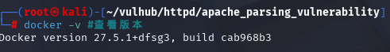
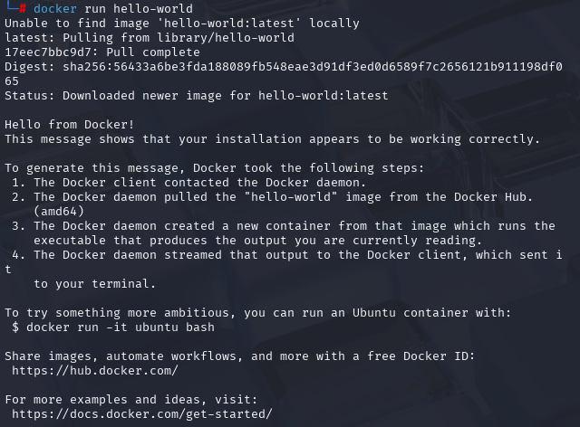

# 下载

　　我是在kali上下载的

　　查看kali是否换源 默认kali会使用国外源进行文件下载，需要**更改为国内的源以提高下载速度**

　　**vi /etc/apt/sources.list**

　　**apt-get update #更新源**

　　**apt install docker.io -y #安装docker**

　　**systemctl start docker   # 启动服务
systemctl enable docker  # 开机自启**

　　 **docker -v #查看版本**

　　能查看说明安装成功 正常运行

　　**注意docker安装后，默认也是docker的官方源，直接使用会非常慢，也有可能下载不成功，所以要换成国内的才能够提高下载速度**

　　**vim /etc/docker/daemon.json #打开docker源文件**

　　点击**i**进入编辑模式

　　将源粘贴进去

　　然后按Esc退出编辑模式然后输入 **:wq 保存并退出**

　　里面有自己专属地址并有一键代码

　　保存完成可以输入**docker info**查看

　　sudo systemctl daemon-reload #下载镜像

　　sudo systemctl restart docker #重启docker

　　接下来进行测试，docker自带一个hello-world环境，我们可以启动这个环境来测试docker能否正常运行

　　**docker run hello-world**

　　成功运行

　　**安装docker-compose**

　　**apt install docker-compose -y**

　　**docker-compose --version  # 显示版本即正常**

　　完成
