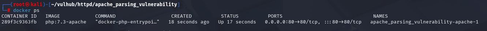
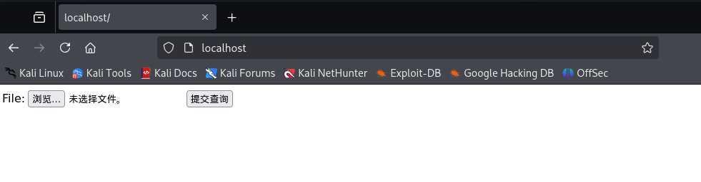

# 部署vulhub

　　**Vulhub 的每个漏洞环境都通过docker-compose.yml定义，需安装 Docker-Compose**

　　安装过就不用管

　　‍

### **获取 Vulhub 源码**

　　Vulhub 源码托管在 GitHub，通过git克隆到本地（若未安装 git，先执行**apt install git -y**）

　　‍

　　克隆官方仓库（若速度慢，可替换为国内镜像，如gitee）：

　　**git clone https://github.com/vulhub/vulhub.git**

　　国内镜像（推荐）：

　　​**​`git clone https://gitee.com/puier/vulhub.git`​**

　　这里以apache的某个历史漏洞为例演示如何使用docker-compose开启环境

　　**cd ~/vulhub/httpd/apache_parsing_vulnerability**

　　**docker-compose up -d #运行**

　　查看启动环境

　　**docker ps**

　　可以看到容器里的80端口映射到了kali的80端口上 访问

　　接下来就可以进行正常的漏洞复现了

　　**sudo docker-compose down #关闭**

　　‍
