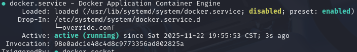
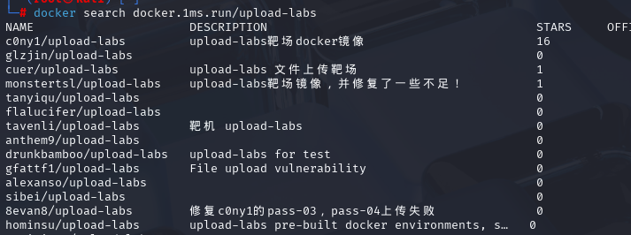
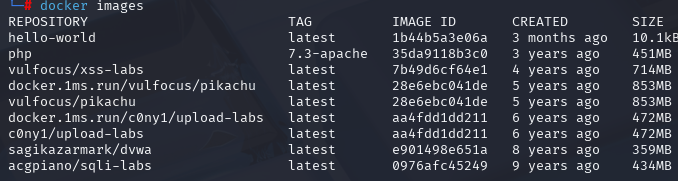
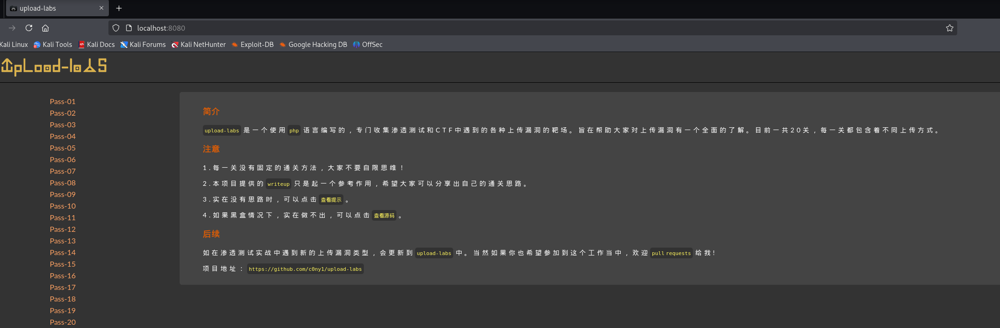
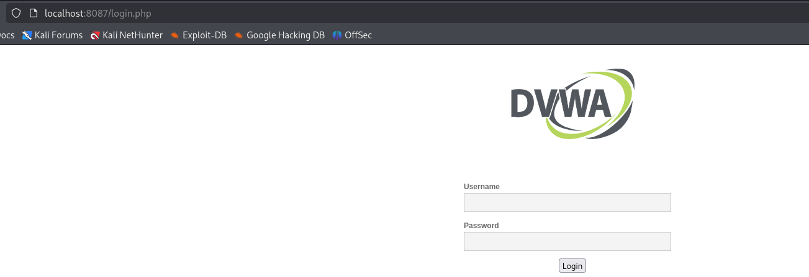
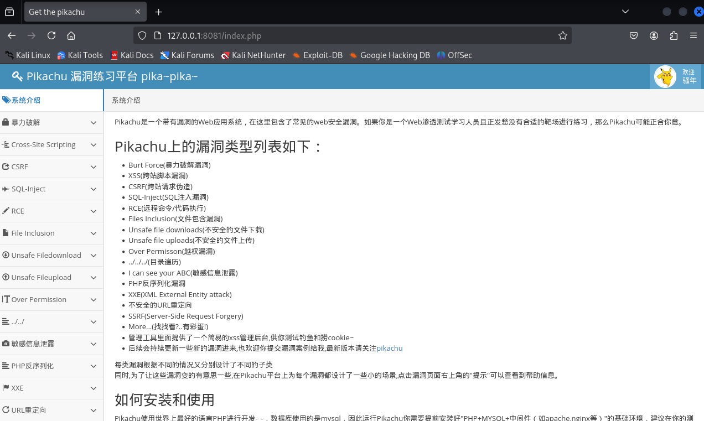
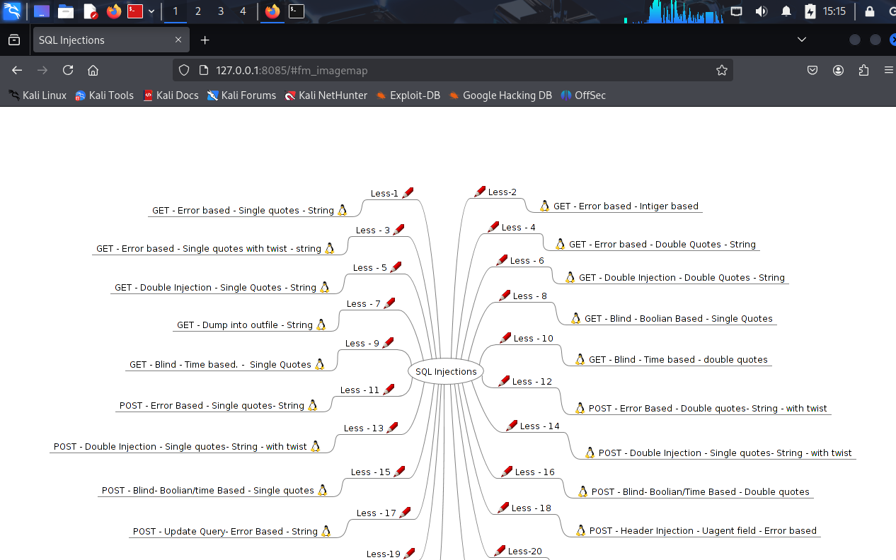
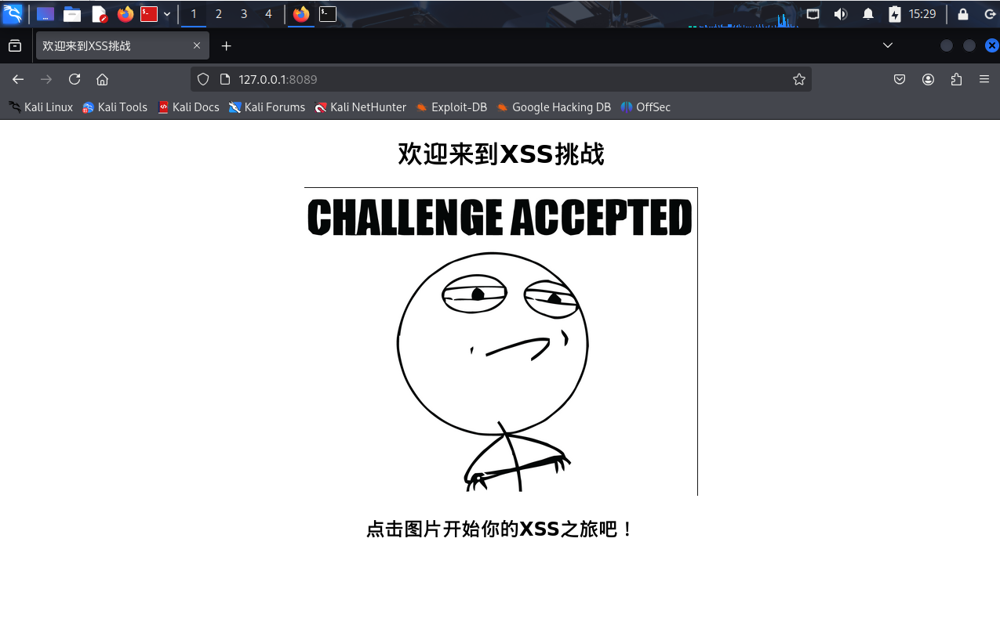

# 部署经典靶场（pikachu、dvwa等）

　　之前换过源保证下载成功就可以进行下载了

　　同样先更新下源

　　**apt-get update**

　　查看docker启动情况

　　**sudo systemctl status docker**

　　这里介绍**Docker Hub镜像搜索**，能帮助我们快速查找、下载和部署 Docker 容器镜像，主要是找对应的镜像，**方便去kali里面的docker拉取，它包括但不仅限于靶场搭建**，下面靶场都是基于这个东西搭建的，非常快速，还有就是可能常规的pull和search命令拉去不了，比如超时之类的

　　‍

　　**靶场镜像下载**

　　可以先搜索一下 我这里常规搜索超时

　　**docker search docker.1ms.run/upload-labs**

　　找到最为推荐的拉取

　　**docker pull docker.1ms.run/c0ny1/upload-labs #推荐**

　　 **（用这种方法可以创建更简洁的标签）**

　　**docker tag docker.1ms.run/c0ny1/upload-labs c0ny1/upload-labs**

　　‍

　　**docker pull c0ny1/upload-labs #常规下载**

　　下载有时候会出错  多试几次

　　同理

　　其他靶场也是这样下载

　　查看下载文件

　　**docker images**

　　‍

　　**靶场搭建运行**

　　**docker run -d -it -p （指定端口号:80） 镜像名或id 命令**

　　**docker run  -d -it-p 8080:80 c0ny1/upload-labs #运行镜像 端口号就是8080**

　　**127.0.0.1:8080或localhost:8080 启动打开靶场**

　　同理

　　**docker run -d -it  -p 8087:80 sagikazarmark/dvwa**

　　**127.0.0.1:8087 启动打开靶场**

　　**docker run -d -it  -p 8081:80 vulfocus/pikachu**

　　**127.0.0.1:8081**

　　**docker run -d -it  -p 8085:80 acgpiano/sqli-labs**

　　**127.0.0.1:8085**

　　**docker run -d -it  -p 8089:80 vulfocus/xss-labs**

　　**1270.0.1:8089**

　　‍
