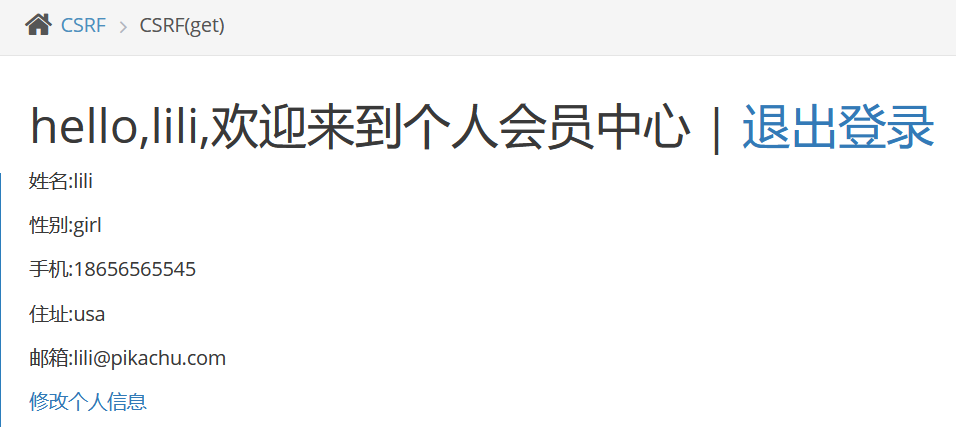
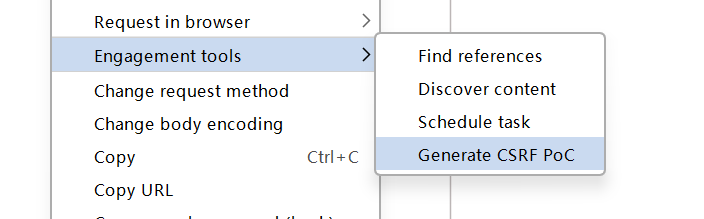
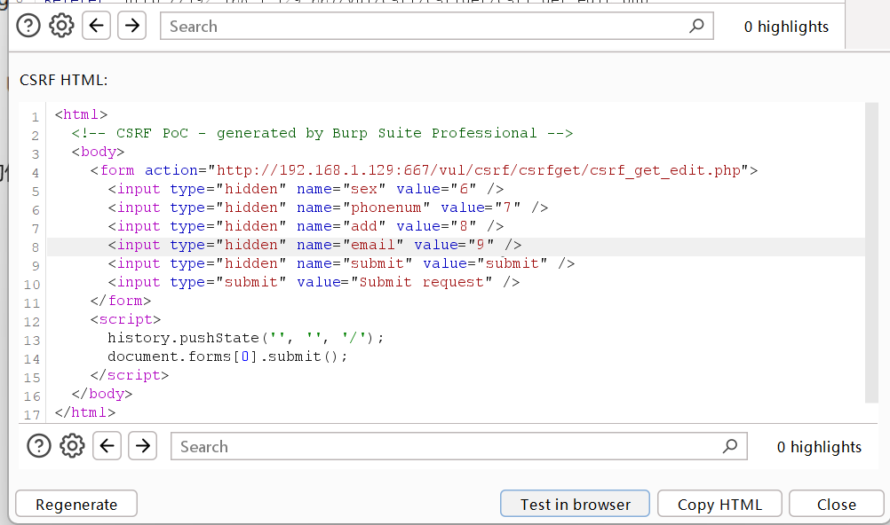
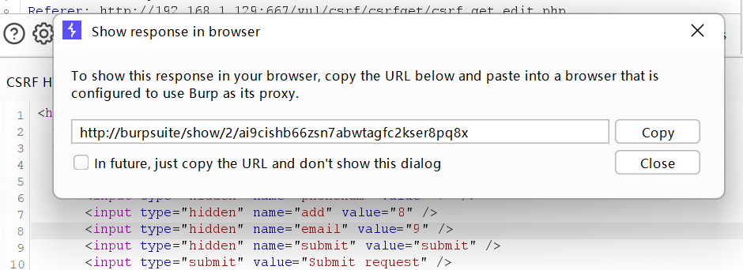
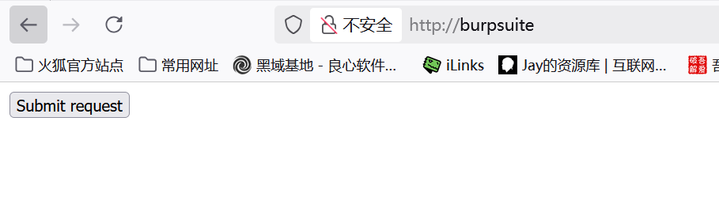
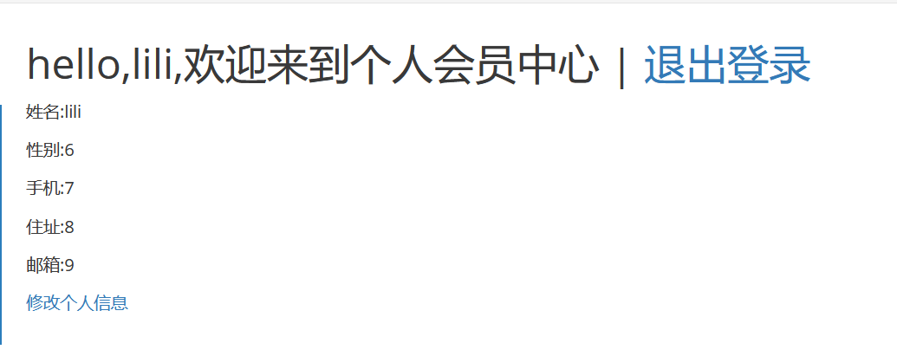

# CSRF(get)

　　根据提示 随意登录一个账号

　　登陆后，我们选择修改个人信息

　　提交修改信息 并用bp抓包

　　抓包放到repeater中 然后右键找到管理工具，生成csrf利用

　　我们可以修改其中的信息，修改完后我们点击test in browser

　　点击复制（copy）

　　打开网址并点击

　　发现修改成功

　　当然我们可以将网址利用短链接网址转化为短网址进行伪装
