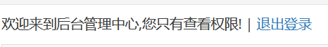
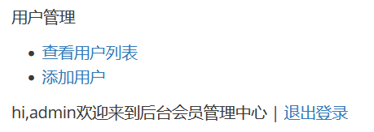
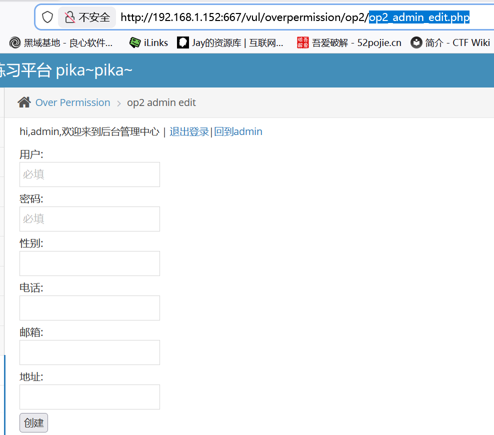
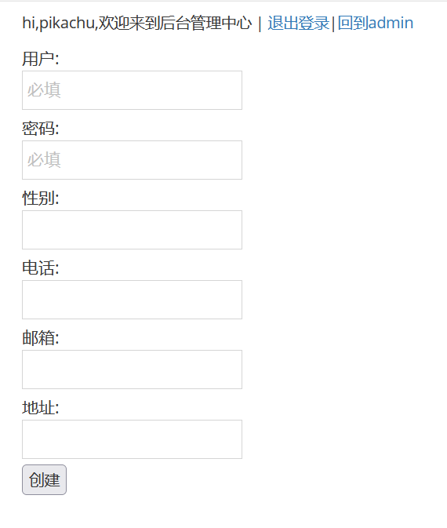
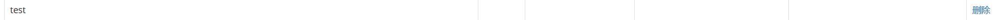

# 垂直越权

　　查看提示知道有一个普通用户和超级用户

　　分别登录发现超级用户多一个添加用户界面

　　要是想要越权肯定是要在超级用户添加用户功能这里做文章

　　进入到超级用户添加用户页面

　　复制该页面.php

　　**op2_admin_edit.php**

　　退出登录 然后登录普通用户

　　修改url

　　创建试试

　　test test

　　然后登录查看用户列表

　　创建成功 成功越权
