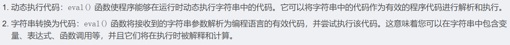

# 知识点

　　eval函数：

1. 动态执行代码: eval () 函数使程序能够在运行时动态执行字符串中的代码。它可以将字符串中的代码作为有效的程序代码进行解析和执行。
2. 字符串转换为代码: eval () 函数将接收到的字符串参数解析为编程语言的有效代码，并尝试执行该代码。这意味着您可以在字符串中包含变量、表达式、函数调用等，并且它们将在执行时被解释和计算。

　　**eval函数可以把字符串当成 PHP 代码来执行**
