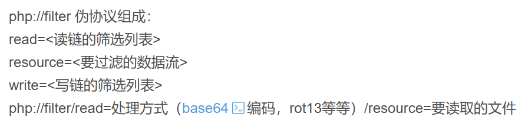
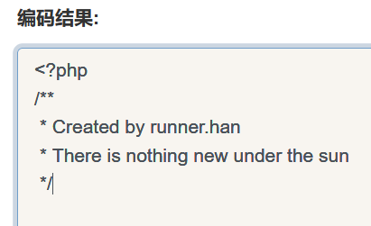
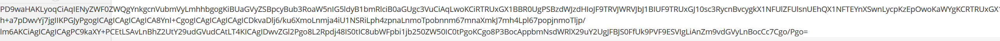
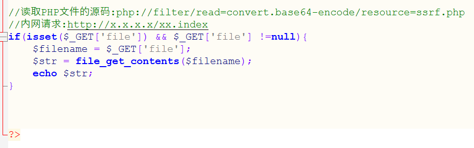
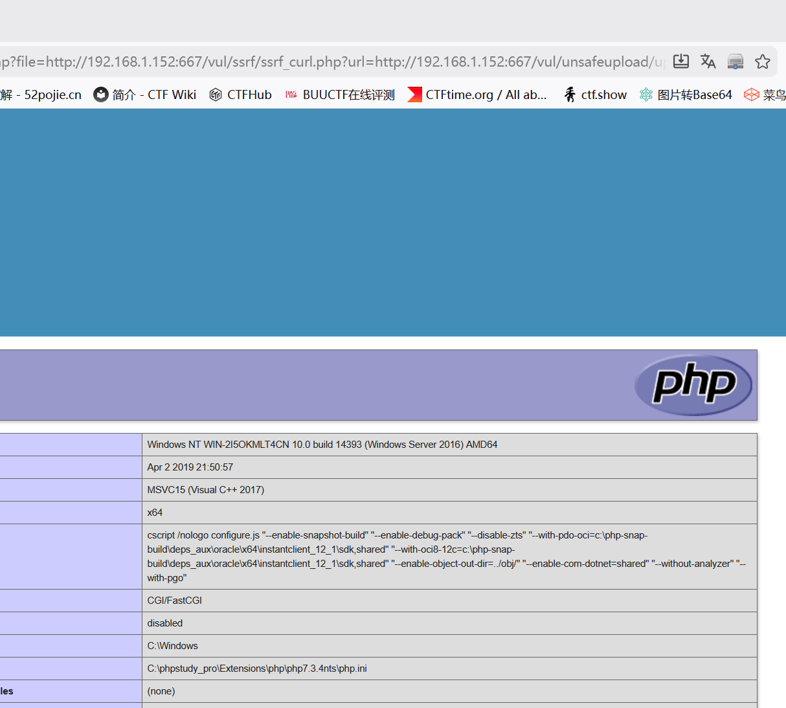
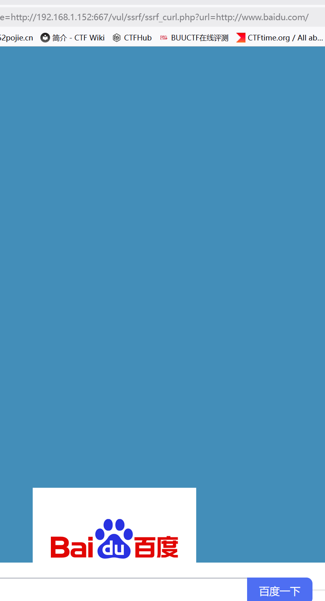

# SSRF(file_get_content)

　　点击显示内容，在URL中发现file参数，可以利用伪协议进行本地文件读取也可以进行源码查看

　　读取PHP文件的源码:

　　**php://filter/read=convert.base64-encode/resource=ssrf.php**

　　php伪协议

　　这里读取但不执行获得源码 但是需要base64解码

　　这关与上关不同的是

　　它这里使用**file_get_contents**函数进行文件的读取执行，而**file_get_contents**函数可以对本地文件进行读取，也可以对远程文件进行读取。

　　同样也可以访问服务器文件

　　 访问网站

　　‍
