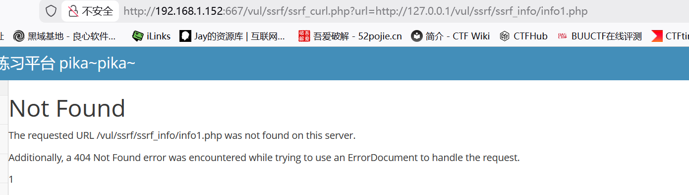
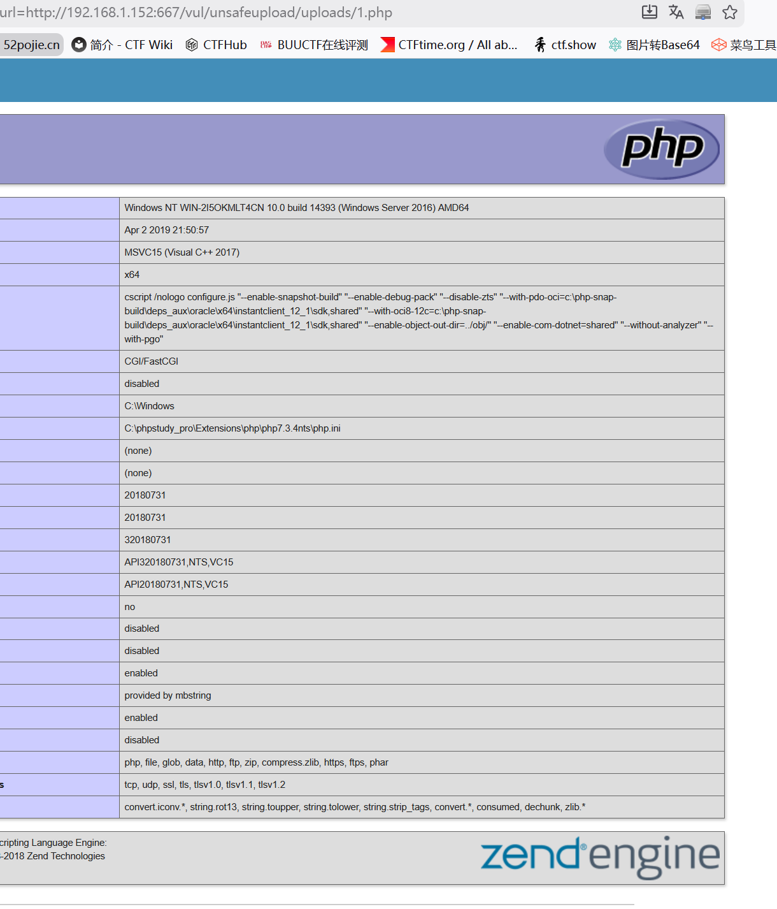
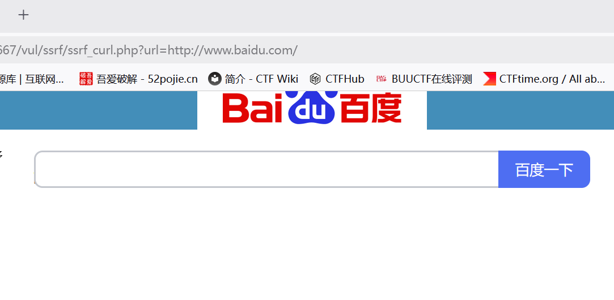

# SSRF（curl）

　　点击超链接

　　发现是通过url传参的 这里找不到是因为读取的问题 这里127.0.0.1应该是靶机ip+端口

　　因为我搭建pikachu并不是本地

　　强迫症自己改一下 我认为无伤大雅

　　所以我们可以让他访问我们服务器上的木马文件

　　这里我用的是文件上传漏洞所上传的php文件

　　**http://192.168.1.152:667/vul/ssrf/ssrf_curl.php?url=http://192.168.1.152:667/vul/unsafeupload/uploads/1.php**

　　也可以重定向访问网站

　　这里也可以利用其他协议进行操作，如file读取本地文件，就不具体演示了
