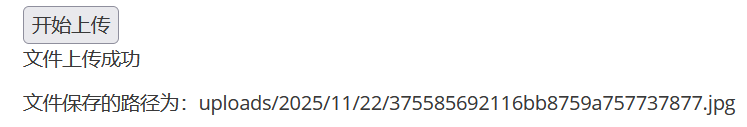
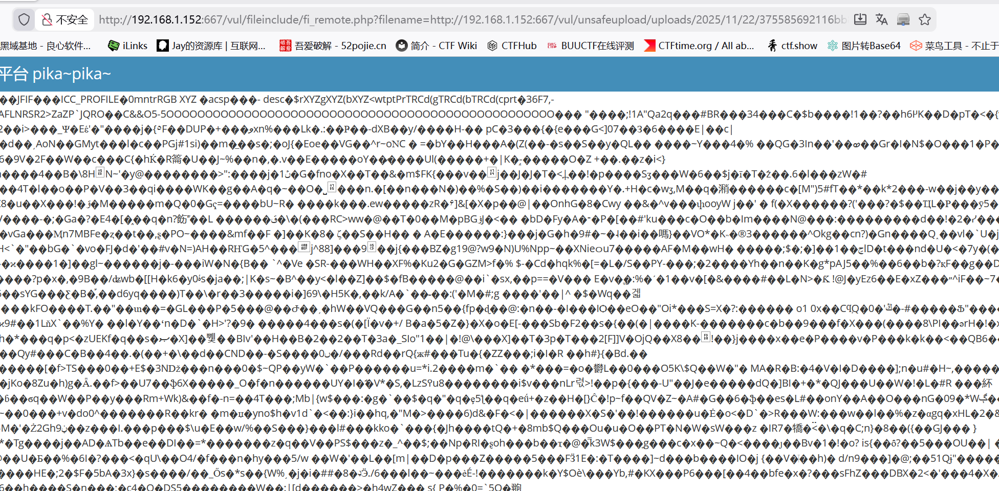
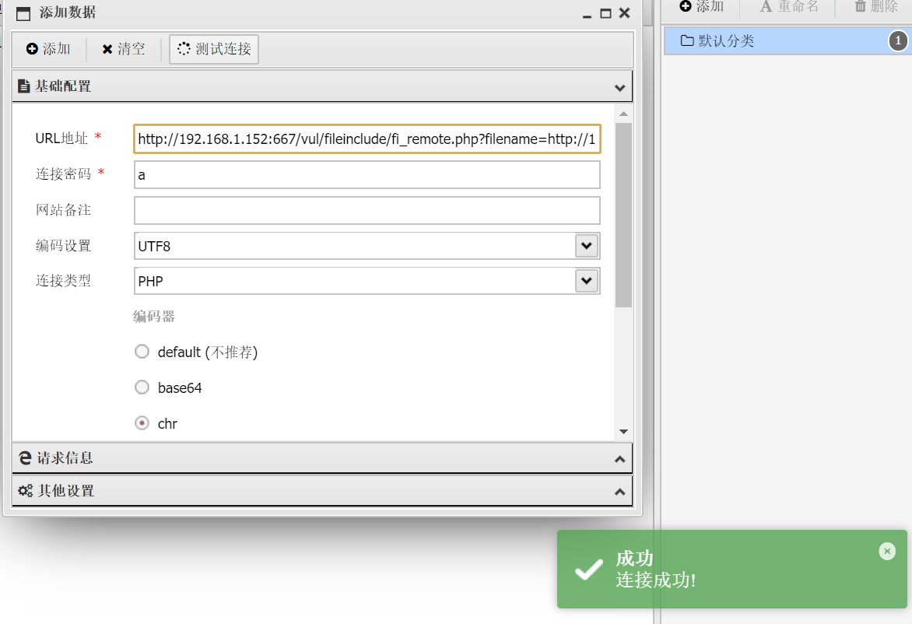

# getimagesize(获取图片信息函数)

　　getimagesize()：它是php提供的，通过对目标文件的16进制进行读取，通过该文件的前面几个字符串，来判断文件类型。  
getmagesize()返回结果中有文件大小和文件类型。  
固定的图片文件，十六进制的头部的前面的几个字符串基本上是一样的，比如说png格式的图片，所有png格式的图片前面的十六进制都是一样的。  
思路：**我们就是要通过伪造十六进制的头部字符串来绕过getimagesize()函数，从而达到上传的效果**。

　　‍

　　方法一、直接伪造头部GIF89A  
方法二、制作图片马，配合文件包含漏洞进行漏洞利用  
CMD中输入命令: copy /b 1.jpg + shellweb.php upload.jpg 进行图片与一句话木马的捆绑，然后进行上传，之后再文件包含漏洞界面利用php伪协议进行图片马执行，获取shell。也可以直接抓包图片在图片内容末尾加上php代码或是利用文本编辑器添加。

　　这里我制作了一个webllphp

　　上传

　　找到文件路径

　　**http://192.168.1.152:667/vul/unsafeupload/uploads/2025/11/22/375585692116bb8759a757737877.jpg**

　　蚁剑测试连接

　　这里我们会发现连接不上，因为**这是jpg文件，php代码并不会执行，这里我们需要配合之前的文件包含进行连接**

　　这里使用本地或是远程都行

　　我这里用的是远程

　　这里乱码了代表php应该是运行了

　　在测试连接试试

　　**http://192.168.1.152:667/vul/fileinclude/fi_remote.php?filename=http://192.168.1.152:667/vul/unsafeupload/uploads/2025/11/22/375585692116bb8759a757737877.jpg&amp;submit=%E6%8F%90%E4%BA%A4%E6%9F%A5%E8%AF%A2**

　　成功
