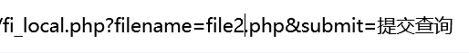
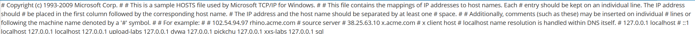

# 1.本地文件包含

　　我们先随便读取一个人物

　　我们在url中可以尝试修改filename后的文件名读取其他的文件

　　显而易见

　　那么我们是否能读取本地除该目录下的文件呢

　　假设我们该后台的操作系统是win11，其中有很多固定的配置文件,我们可以多敲几个…/…/…/…/…/…/…/…/…/跳转到根目录，我们将文件名替换（**这里../是返回上一级目录的意思）**

　　 **../../../../Windows/System32/drivers/etc/hosts**

　　**本地文件包含可以将存于服务器本地的文件进行包含读取，如可以将服务器敏感文件进行包含读取**

　　获取到了敏感信息

　　‍
