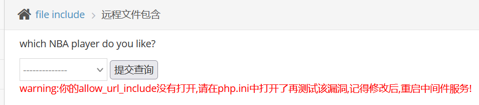
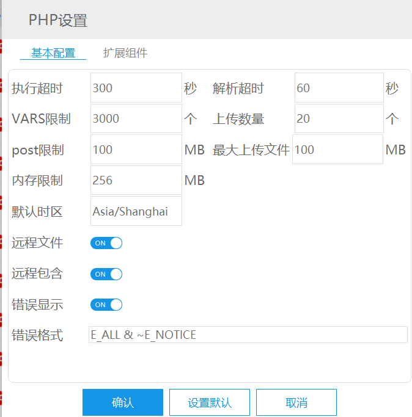
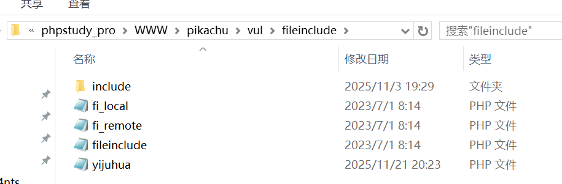
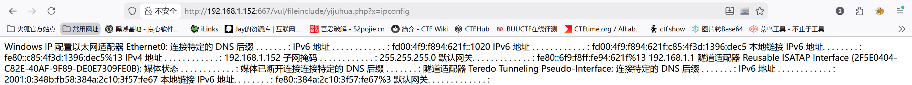

# 2.远程文件包含

　　远程文件包含漏洞形式和本地文件包含漏洞差不多，在远程包含漏洞中，攻击者可以通过访问外部地址来加载远程代码。  
远程包含漏洞前提，如果使用的是include和require函数，则需要php.ini配置如下（php5.4.45）：  
allow_url_fopen=on //默认打开  
allow_url_include=on //默认关闭  
写入一句话木马，**危害极大**，可以直接上传SHELL，拿到web的权限

　　‍

　　这里得打开远程包含，否则无法进行靶场训练（默认是关的）

　　选择一个提交，观察url

　　于是我们在url中修改成远程路径文件来读取

　　我这里用pikachu/test/yijuhua.txt 提供的一句话木马文件

　　这里是文件里面的内容是生成一句话木马php

　　用于**执行操作系统的命令**

　　这里构造上传

　　**http://靶机ip/test/yijuhua.txt**

　　**http://192.168.1.152:667/test/yijuhua.txt**

　　这里自动生成php文件

　　于是就可以执行相应命令

　　通过yijuhua.php构造url

　　**http://靶机ipvul/fileinclude/yijuhua.php?x=ipconfig**

　　**http://192.168.1.152:667/vul/fileinclude/yijuhua.php?x=ipconfig**

　　可以看到这里执行系统命令

　　这里也可以上传webshell文件连接进入后门，就不展示了
