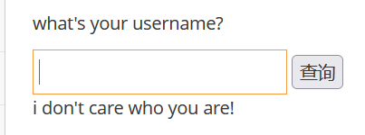

# 基于时间的盲注

　　如果说基于boolean的盲注在页面上还可以看到0 or 1的回显的话那么基于时间的盲注完全就啥都看不到了

　　但还有一个条件，就是“时间”，通过特定的输入，**判断后台执行的时间，从而确认注入!**

　　常用的Payload: 1 and sleep(5)#

　　这里不管输入啥，回显都是一样的

　　**输入**

　　 **kobe' and sleep(5)#**

　　**页面会加载5秒才会回显 说明存在时间注入**

　　**F12打开网络页面即可看到耗时**

　　我们可以**利用if函数 if(条件,为真时执行的操作，为假时执行的操作)
kobe' and if((substr(database(),1,1))='p',sleep(5),null)#**

　　延时 可以判断出，当前数据库名的第一个字符为p

　　以此类推

　　‍
