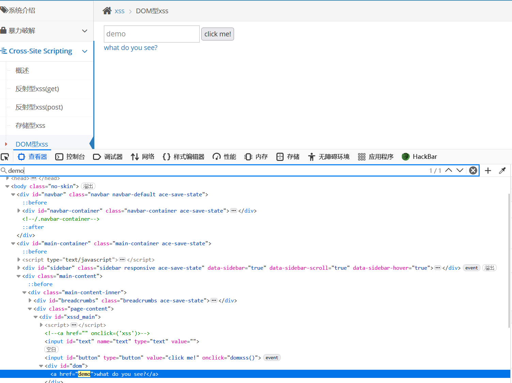
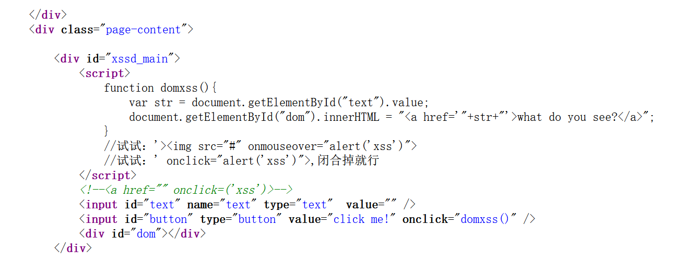
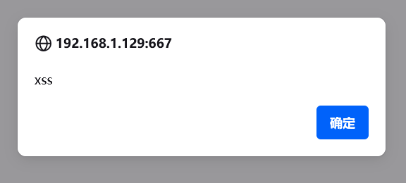

# DOM型xss

　　先来了解一下DOM:

　　**DOM是一种用于表示和操作HTML、XML等文档结构的编程接口，通过它可以使用代码来访问、修改和操作Web页面的内容和结构。**

　　简单说**DOM型就是将XSS输入到标签属性中了，利用属性进行触发**

　　在输入框里随便输入内容 再按F12检查语句

　　找到输入的内容，我们就要想办法构造payload了，首先我们需要先闭合我们的语句，然后构造一个onclick（点击）

　　在F12这里看以为是双引号闭合，构造出来不对 右键查看源代码发现，外面还有一个单引号

　　于是payload应该是 **：' onclick=alert('xss')&gt;**

　　闭合后语句为：<a href=''  **（前面语句被注释掉）** onclick=alert(‘xss’)>'>what do you see?</a>

　　成功

