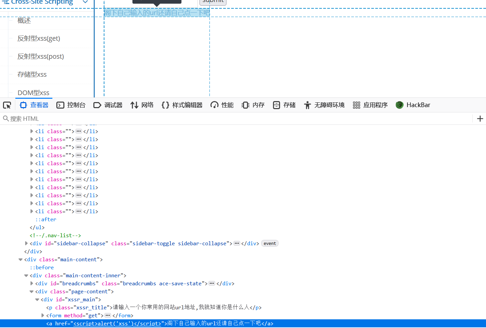
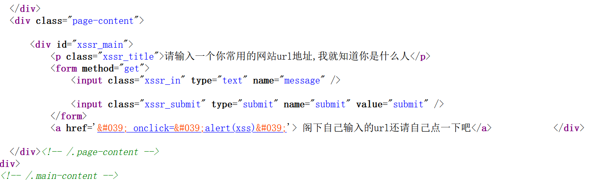
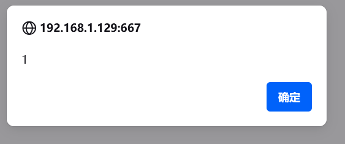

# xss之href输出

　　试试之前的payload：

　　 **&lt;script&gt;alert("xss")&lt;/script&gt;**

　　发现没有用

　　检查源代码

　　尝试利用a标签 ' onclick='alert(xss)'

　　发现没有效果 检查页面源代码

　　**发现左右尖括号和单双引号都被html编码了**

　　这里可以利用JavaScript 代码段

　　**javascript:alert(1)**

　　成功
