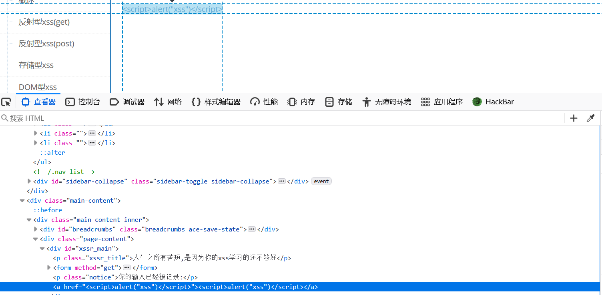
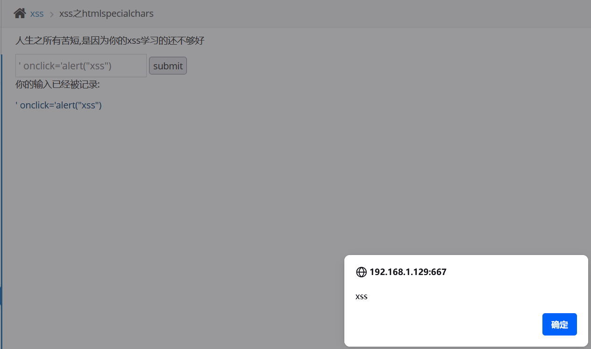

# xss之htmlspecialchars

　　依旧试下之前payload：

　　 **&lt;script&gt;alert("xss")&lt;/script&gt;**

　　看了提示让我们了解htmlspecialchars

　　htmlspecialchars() 是 PHP 中最基础、最重要的安全函数之一，它是**防止 XSS（跨站脚本攻击） 的第一道防线**。虽然它简单，但其背后涉及字符编码、HTML 实体、安全上下文、Web 安全模型等深层知识。

　　htmlspecialchars()函数**把预定义的字符转换为HTML实体**  
&(和号)成为&  
“(双引号)成为”  
‘(单引号)成为’  
<(小于)成为<  
‘>’(大于)成为>

　　‍

　　检查一下源代码 可以尝试利用a标签

　　payload： **' onclick='alert("xss")**

　　闭合后语句：<a href='' onclick='alert("xss")'>

