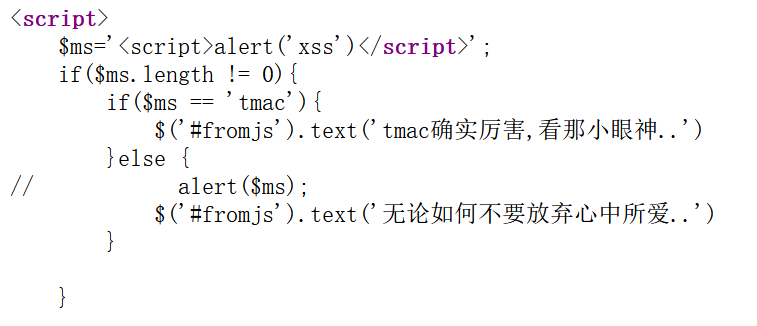
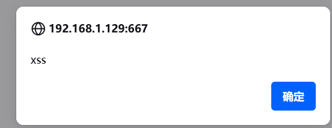

# xss之js输出

　　依旧试下之前的payload：

　　 **&lt;script&gt;alert('xss')&lt;/script&gt;**

　　没有反应 我们检查一下源代码

　　发现<script>标签对应有问题 于是得让前一个先闭合

　　于是： **&lt;/script&gt;&lt;script&gt;alert('xss')&lt;/script&gt;**

　　成功
