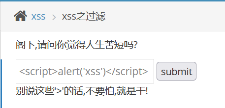
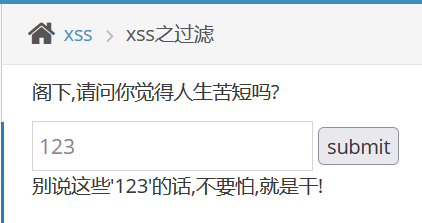
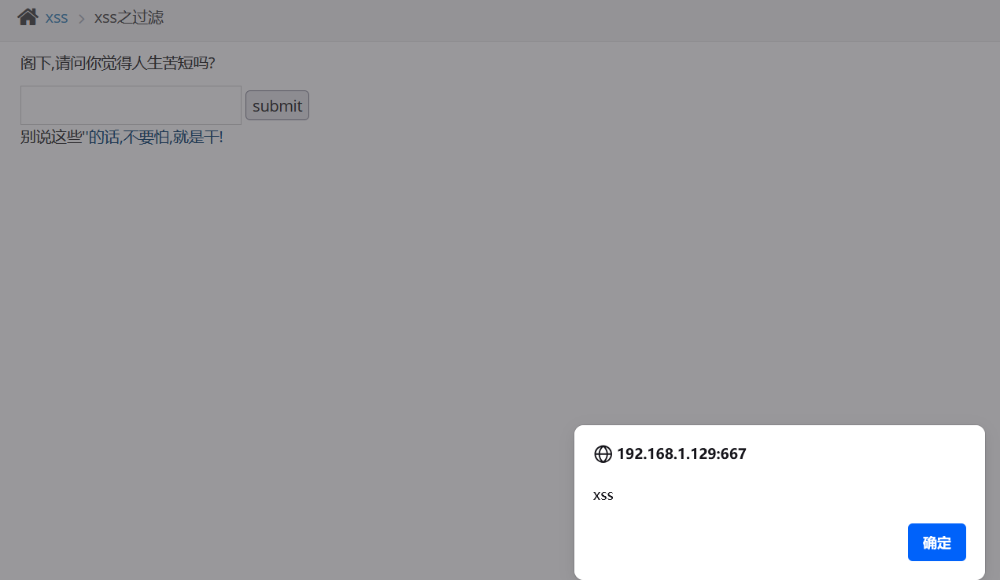

# xss之过滤

　　输入之前的payload试试

　　 **&lt;script&gt;alert('xss')&lt;/script&gt;**

　　发现被过滤了

　　输个123试试

　　经过数次尝试 发现是 **&lt;script&gt;标签被过滤了**，我们可以需要其他的方法绕过

　　payload：

　　 **&lt;a href="" onclick="alert('xss')"&gt;**

　　构造了一个超链接点击事件的xss

