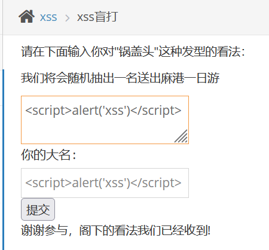
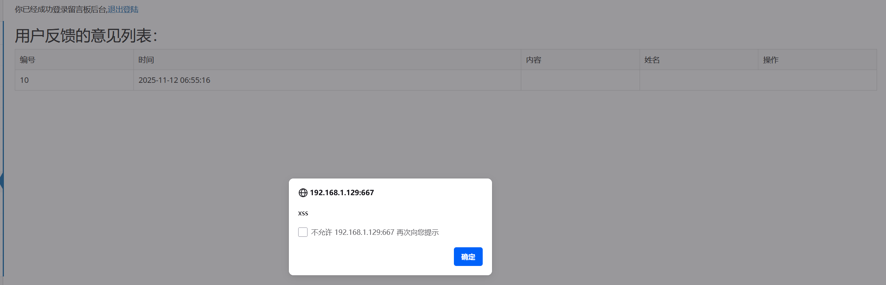

# xss盲打

　　XSS盲打就是**攻击者在进行XSS插入时不会在前端有回显，但是在后台可以看得到，当管理员进行后台登录时就会看到XSS的内容**，如果存在这种漏洞危害性还是很大的，因为能直接盗取管理员的COOKIE拿到权限，但又十分隐蔽，只能进行尝试不能确保一定存在。

　　payload：

　　两个输入框都输入试试

　　根据提示进入后台 登陆

　　弹出弹窗 并且是两次 说明两个输入框都具有xss漏洞

　　‍
