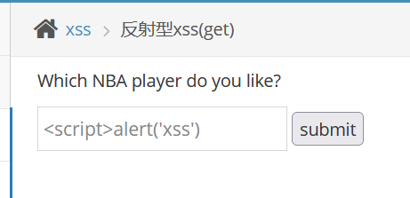
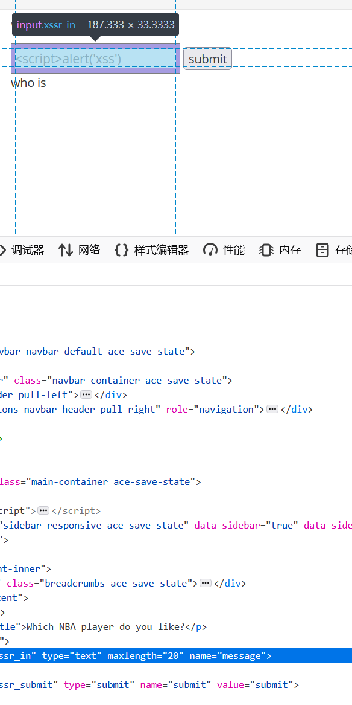
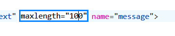
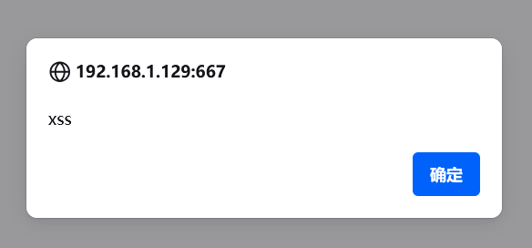
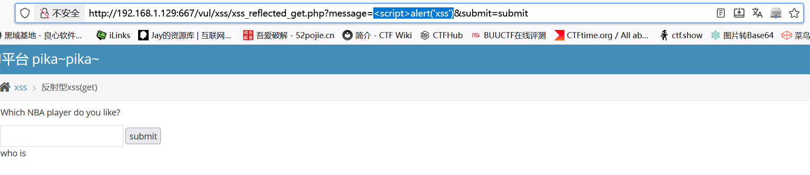
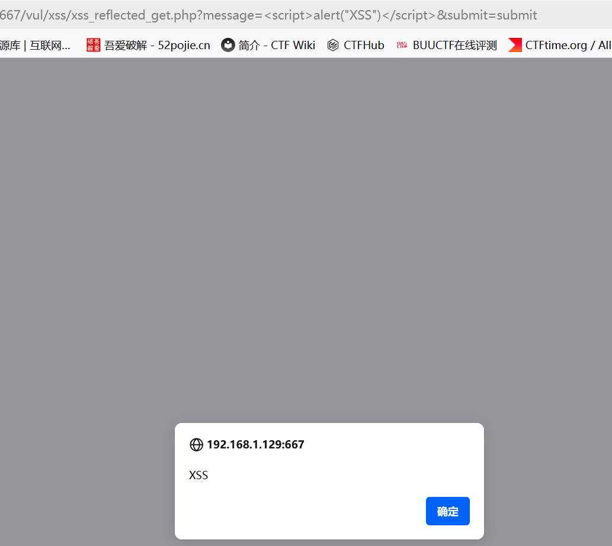

# 反射型xss(get)

　　**xss口令：见框就插
基本检测语句：&lt;script&gt;alert("XSS")&lt;/script&gt;**

　　构造payload：

　　 **&lt;script&gt;alert('xss')&lt;/script&gt;**

　　发现长度被进行限制

　　**方法一：修改前端**

　　F12 找到选择这个输入框

　　 将最大长度改为100，我们就可以正常输入内容了

　　**方法二：在url中输入**

　　先随意输入

　　发现输入的参数与URL中的message参数绑定

　　于是我们在这里输入payload

