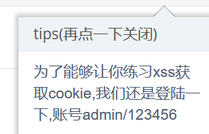
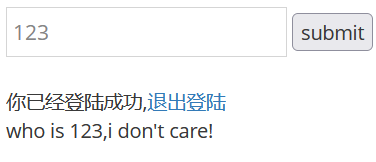
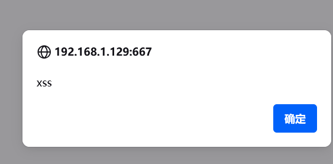

# 反射性xss(post)

　　我们发现一个登录框，我们在暴力破解那一关，获取到了管理员账号和密码，即

　　账号：admin

　　密码：123456

　　如果没做暴力破解我们也可以点一下提示看一下

　　‍

　　尝试输入，发现在下方存在数据回显

　　输入账号密码后来到输入框，依旧输入我们的payload构造弹窗

　　‍

　　**两关并不一样**

　　我们先看一下post和get请求的区别

　　数据传输方式：

　　GET请求：数据通过URL中的查询参数附加在URL后面，以明文形式传输数据。  
POST请求：数据作为请求的正文发送，而不是通过URL传递。  
数据长度限制：

　　GET请求：有长度限制，受浏览器和服务器对URL长度的限制。  
POST请求：没有固定的长度限制，适合传输大量数据。  
数据安全性：

　　GET请求：数据以明文形式暴露在URL中，容易被窃听和拦截。  
POST请求：数据在请求正文中传输，并可以使用加密协议（如HTTPS）进行传输，相对更安全。  
数据缓存：

　　GET请求：可以被浏览器缓存，可以提高性能。  
POST请求：通常不被浏览器缓存。  
**仔细观察就会发现，get型的那一关，我们输入的payload在url中有显示，而post则没有显示**
