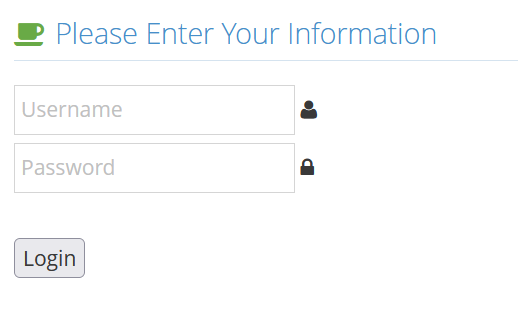
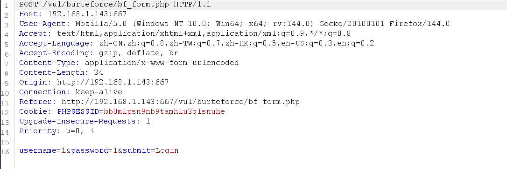
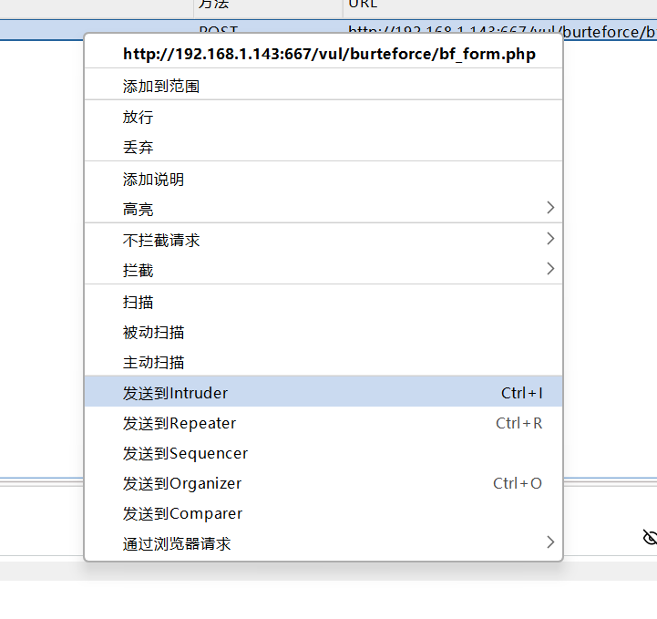
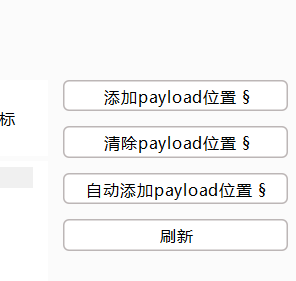
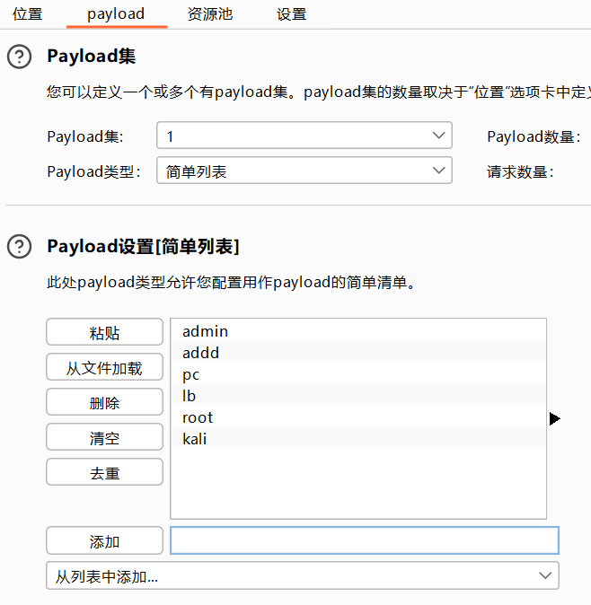
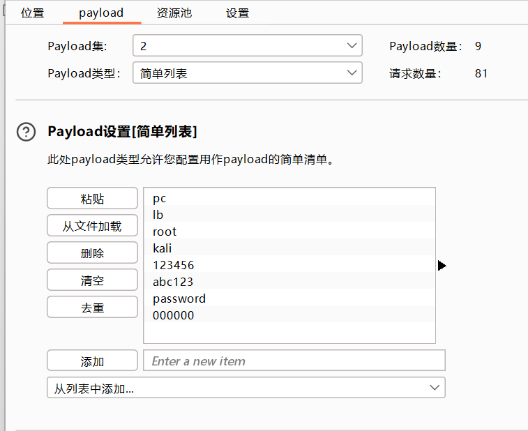
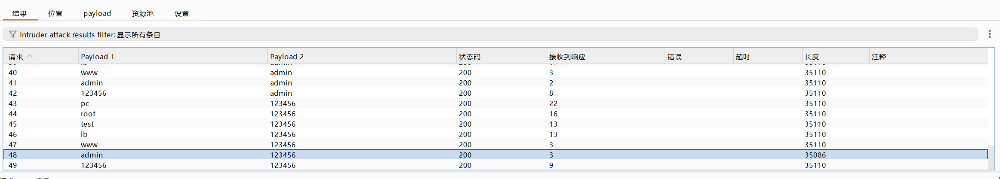
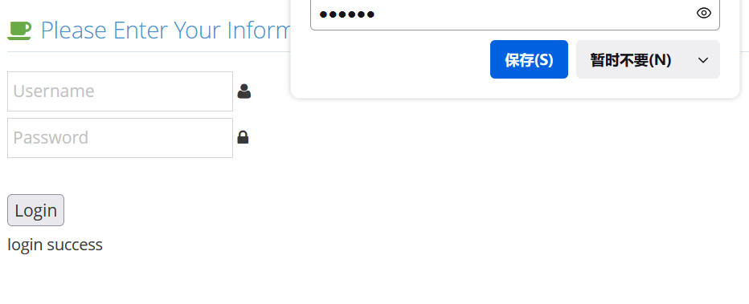

# 1.基于表单的暴力破解

　　打开就是输入账号密码的登录框

　　随意输入利用burp抓包，抓取成功界面如下

　　右键将其发送到intruder（爆破）模块中

　　然后对爆破信息进行标记，首先选择clear，清除默认标记，分别选中username和password，然后点击add进行添加标记，最后选择攻击方式Cluster bomb             #我的是汉化过的

　　 而后进入Payload模块，在payload集1位置，也就是username位置，上传关于我们的账号的字典，在2位置选择我们的密码字典，这里如果没有字典，可以去网上查找，或者直接手动添加爆破的数据

　　看了下提示 知道其账号以及密码 所以这里我就手动添加了

　　进行爆破

　　我们可以根据**返回数据长度来判断**正确的账号密码，返回长度不同于其他数据包的，就是正确的账号密码，此处账号：admin 密码：123456

　　这里去试一下

　　登录成功
