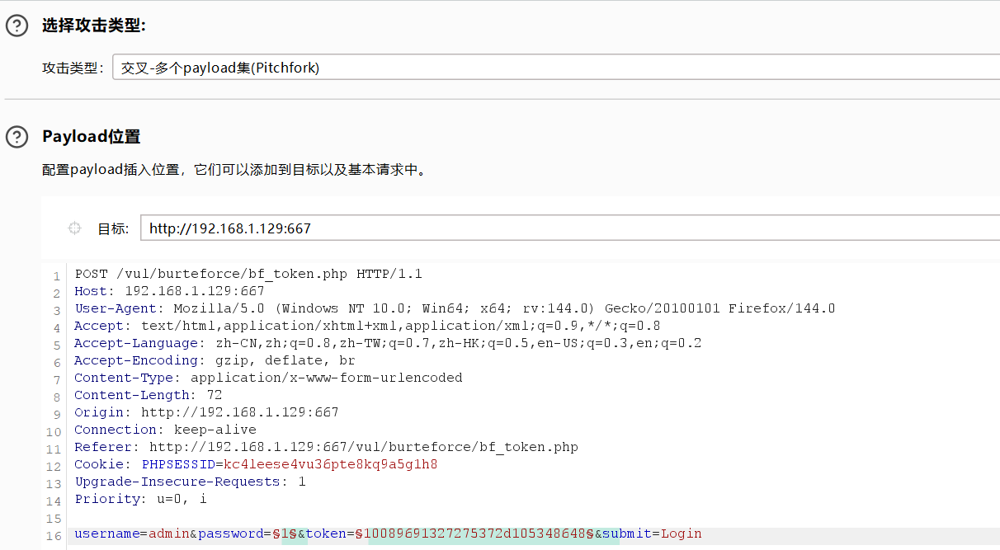
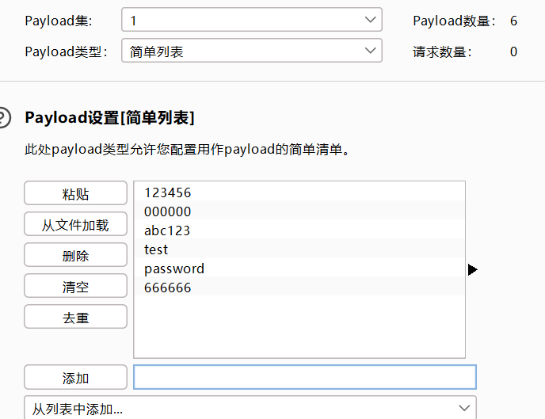
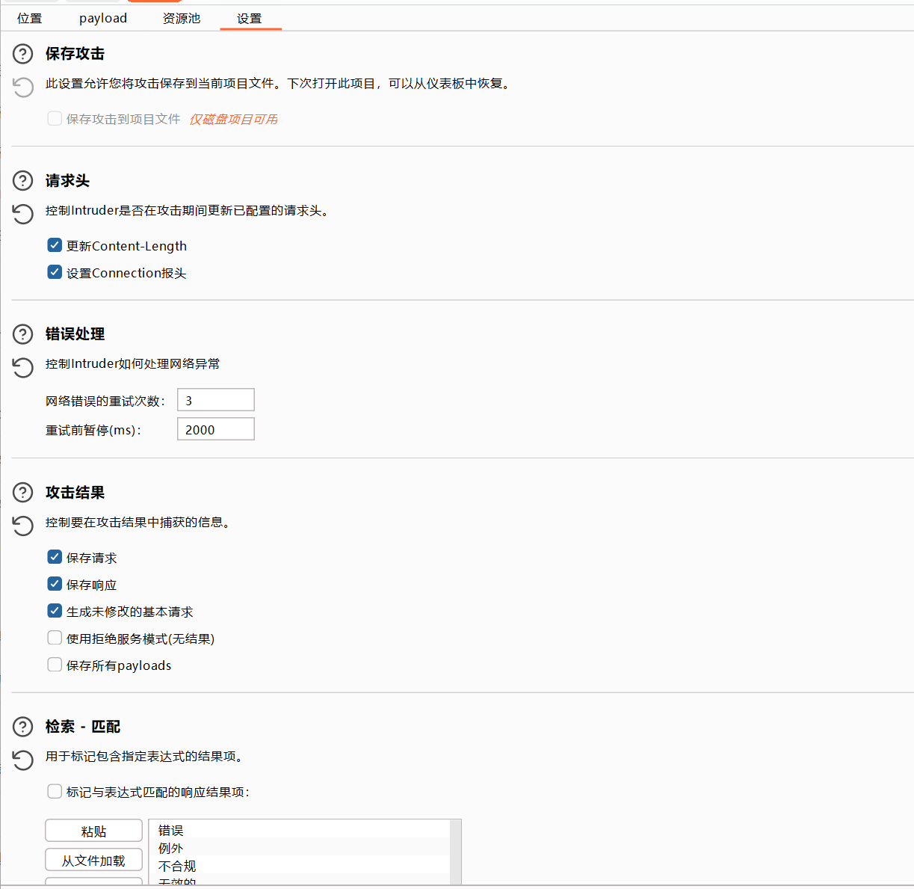
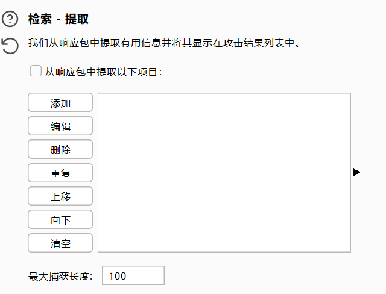
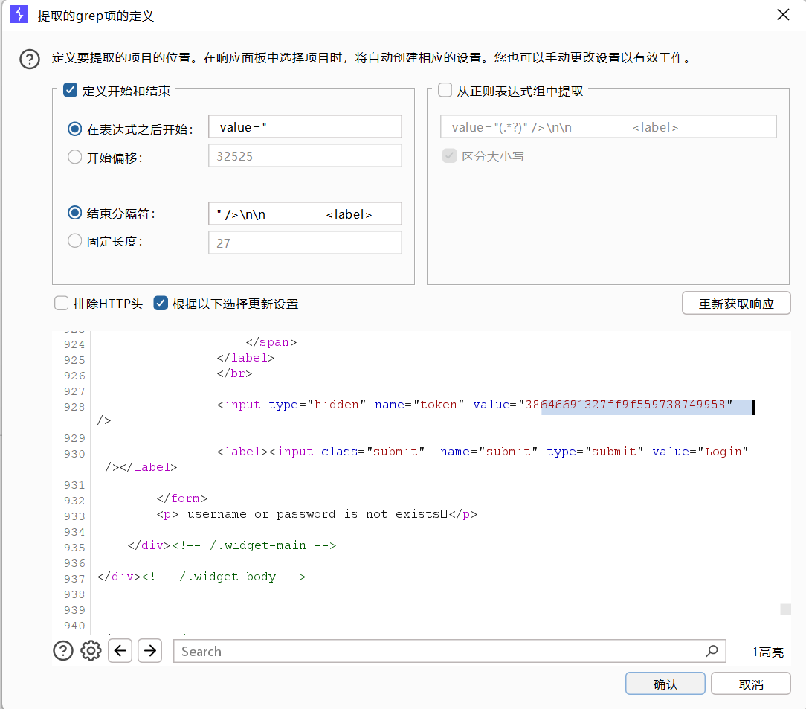
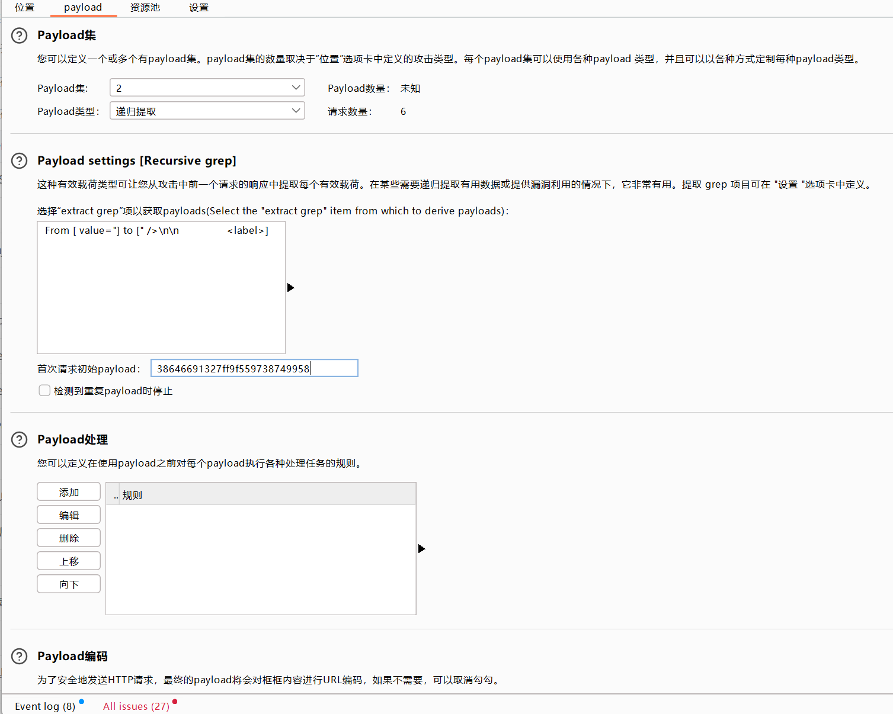
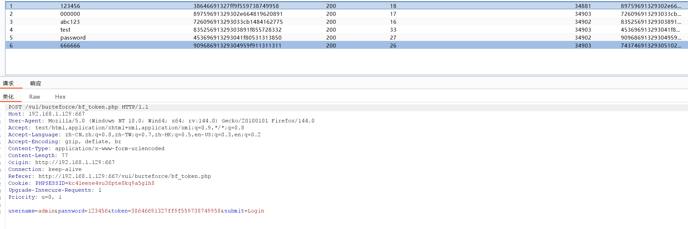

# 4.token防爆破?

　　我们先了解一下token：

　　 **"token"通常指的是一个用于验证用户身份和授权访问的令牌。它是一种特殊的字符串或代码，由服务器生成并分配给经过身份验证的用户。用户在成功登录后，服务器会颁发一个token给客户端（例如Web浏览器），客户端将在随后的请求中将该token作为身份验证凭据发送给服务器。**

　　是一种验证

　　对于有token的的验证，我们**适用于已经知道账号的情况，或者账号和密码一一对应的情况**，并且我们的暴力破解方式就要有所调整，我们依旧是先抓包，并发送到攻击模块

　　这次我们这里的攻击目标要选择password，以及token，攻击方式选择交叉 **（Pitchfork）**

　　来到payloads模块，password设置和之前一样，上传我们的爆破字典即可，第二个位置token处进行如下设置，我们首先来到设置（Options）模块

　　下滑 找到检索-提取（Gerp-Extract）

　　随后我们点击添加Add，并且获取响应

　　将刷新的请求中的数据包下滑，大约在928行左右找到token，**选中并且复制，然后点击确定**

　　再回到payloads模块，前两个位置和前几关一样，正常选择字典即可，第二个位置选择**递归提取（Secursive grep）** ，并且将我们刚刚复制的token粘贴到下面的框里，开始攻击即可

