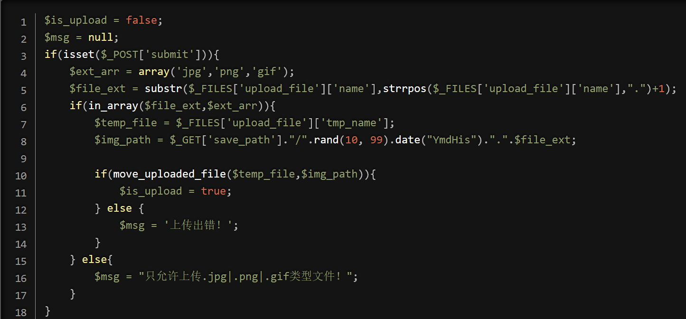
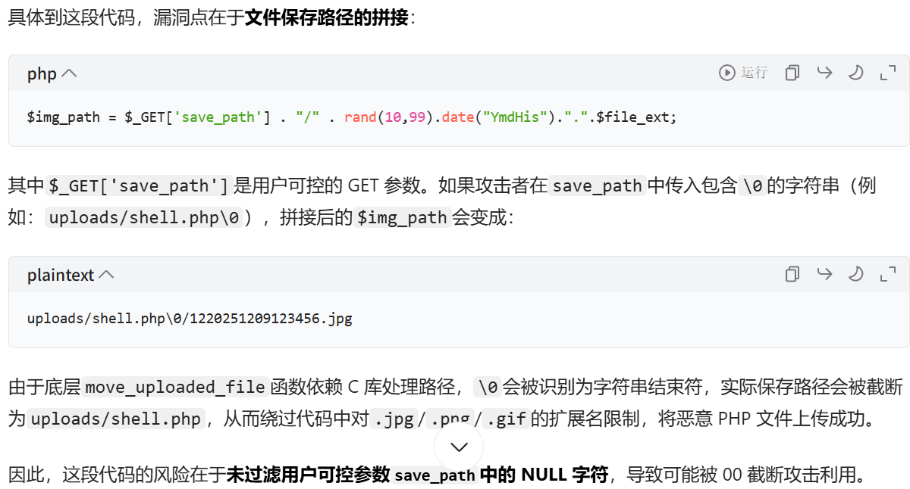
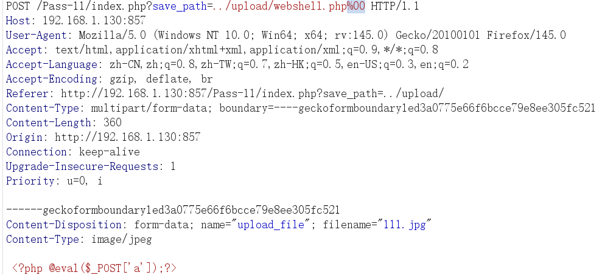
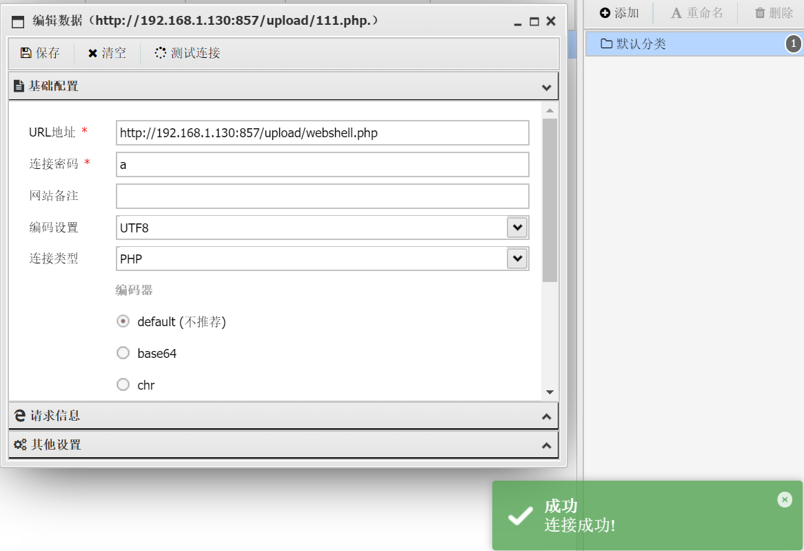

# pass-11

　　查看源码

　　这关可以利用**00截断（php5.3版本之前）**

　　**00截断：**

　　当 PHP 在处理文件名或路径时，如果遇到 URL 编码的 %00，它会被解释为一个空字节（ASCII 值为 0）。在php5.3以前，PHP 会将这个空字节转换为 \000 的形式。

　　而恰恰在php5.3以前，文件名出现\0000,会导致文件名被截断，只保留%00之前的部分。这样的情况可能会导致文件被保存到一个意外的位置，从而产生安全风险

　　这是因为**php语言的底层是c语言，而\0在c语言中是字符串的结束符，所以导致00截断的发生**

　　可以看到**img_path是通过get传参**传递的，那么我们不妨在这块**将路径改掉，改为upload/webshell.php%00，那么后面不管是什么东西都会被截断掉，然后经过move_uploaded_file函数将临时文件重新复制给我们的截断之前的文件路径**，当然，我们**还是要上传jpg文件**的，使得我们可以进行下面程序的运行

　　可以看到后台上传成功了

　　连接成功

