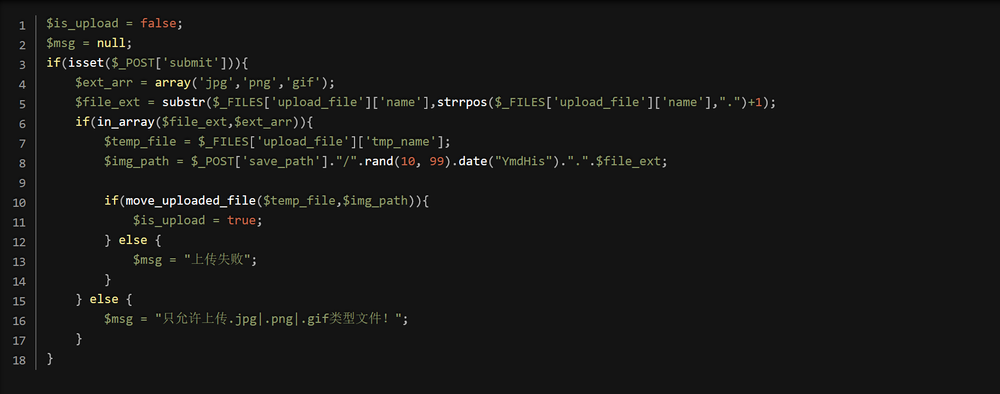
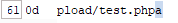
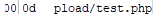
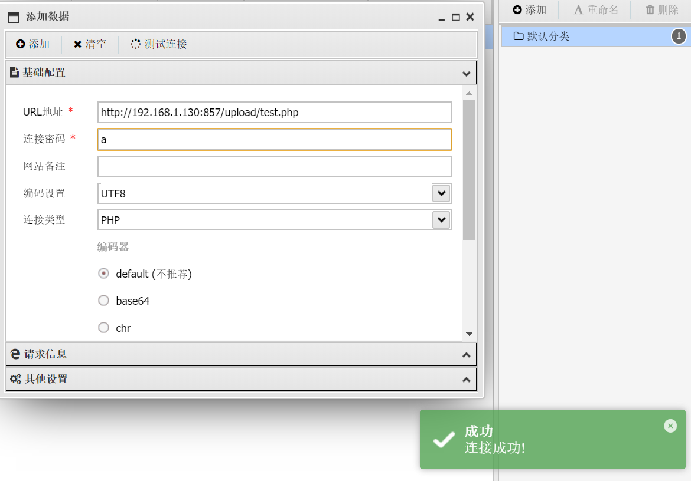

# pass-12

　　查看源码

　　可以看到这关与上关一样都是00截断 只不过变成**post00截断**

　　那么在这关手法就要有点小小的不同了

　　因为上一关 **%00是经过url的编码，而post不会**，所以在这一关我们就需要现在**web.php后面加一个占位符，将其16进制改为00**，这样空字节就出现了，最后在移动文件的时候就会触发\00截断

　　抓包试试

　　改成00

　　小技巧： **不需要修改hex值那么麻烦 只要在burp里面输入%00 然后进行url解码即可 得到就是0x00**

　　连接成功
