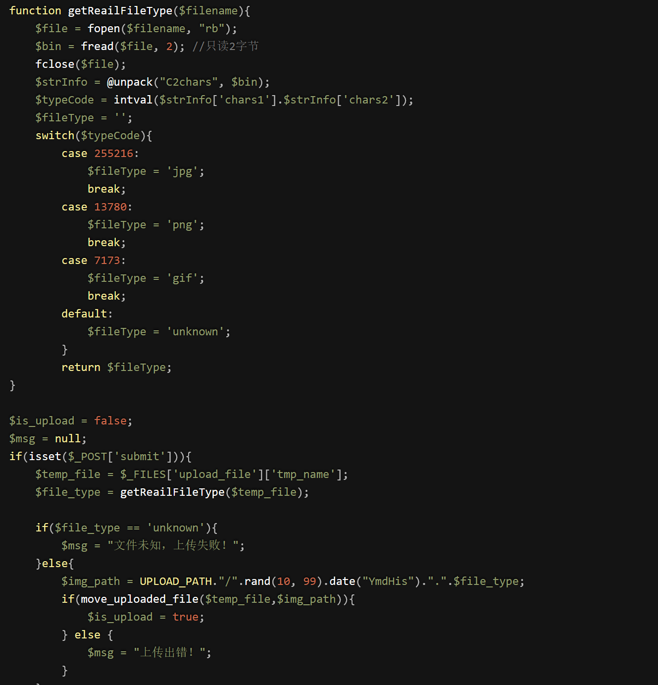
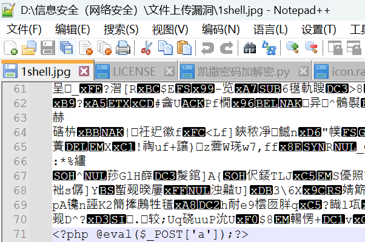
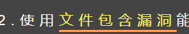
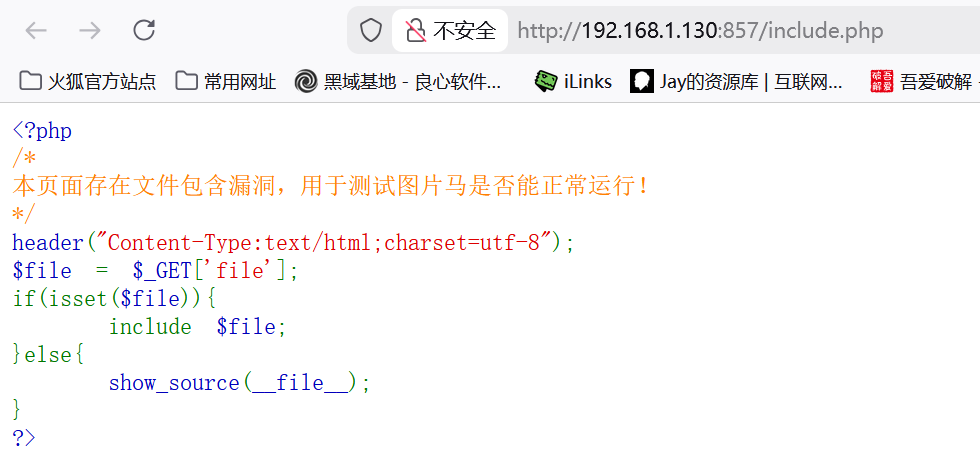
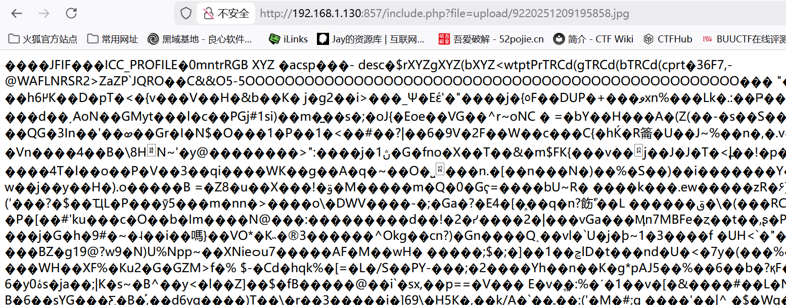

# pass-13

　　这关是图片马 看下源码

　　**getReailFileType()函数中，对图片的头部进行了判断，图片的头部对定义特定的图片类型，所以我们在制作图片码的时候不能再头部进行更改**

　　所以我们**使用编辑器打开图片在文件尾加一句话木马**

　　**或者使用cmd命令** 例：copy web.jpg/b + web.php/a web1.jpg

　　上传成功 但**这里不能直接用蚁剑连接** 这里需要**配合文件包含漏洞使用**

　　点开关卡给的漏洞页面

　　?file=（路径）

　　将连接复制到蚁剑 成功连接

