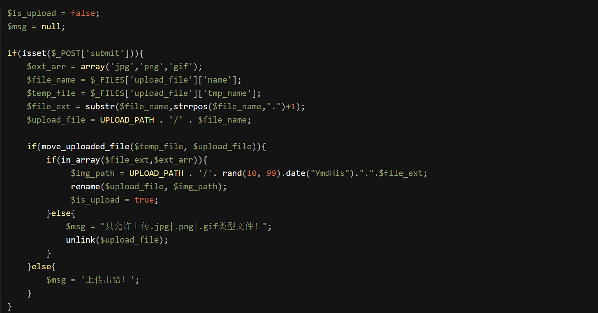
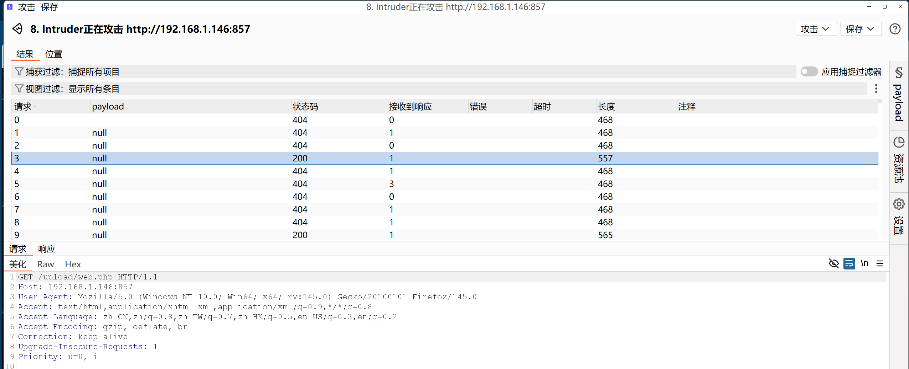
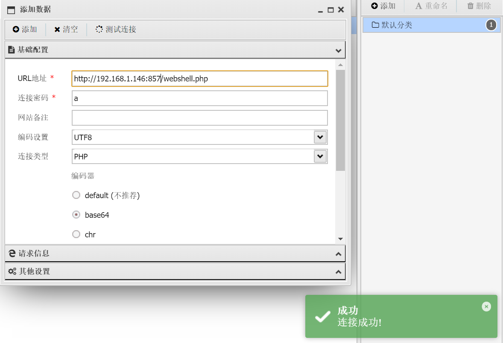

# pass-17

　　查看源码：

　　代码审计：

　　先对文件进行了上传操作，然后在**判断文件的扩展名在不在白名单中，如若在，进行重命名。不在则对其进行删除。**

　　也就是说如果我们上传php文件，它会删除我们上传的木马。

　　这么看来**如果我们还是上传一个图片马的话，网站依旧存在文件包含漏洞我们还是可以进行利用。但是如果没有文件包含漏洞的话，我们就只能上传一个php木马来解析运行了。**

　　假设没有文件包含漏洞，我们需要怎么做

　　因为代码执行需要时间，尽管这个时间很短，只要我们能利用住，能成功的。我们需要在上传的一句话被删除之前访问。

　　叫做**条件竞争上传绕过**。

　　**可以利用burp多线程发包**，然后不断在浏览器访问我们的webshell，会有一瞬间的访问成功。

　　我们可以将一句话写成下面这句：

　　<?php file_put_contents('../webshell.php', '<?php eval($_POST["a"]); ?>'); ?>

　　<?php file_put_contents('../webshell.php', '<?php eval($_POST["cmcaretreplacement"]); ?>

　　将这关php文件**通过burp一直不停的重放**，然后我们**再开一个burp页面一直访问我们的这个php文件，总会有那么一瞬间是还没来得及删除就可以被访问到的，一旦访问到该文件就会在上层目录下生成一个webshell.php的一句话文件**，这样生成的文件是不会被我们的程序删除掉的

　　设置重放次数

　　**访问区状态码200即为访问成功**

　　‍
