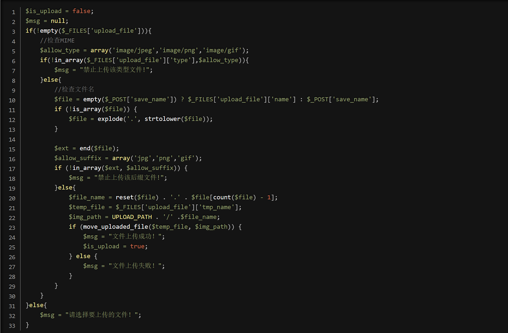
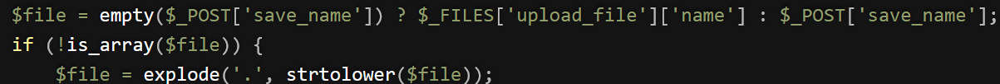
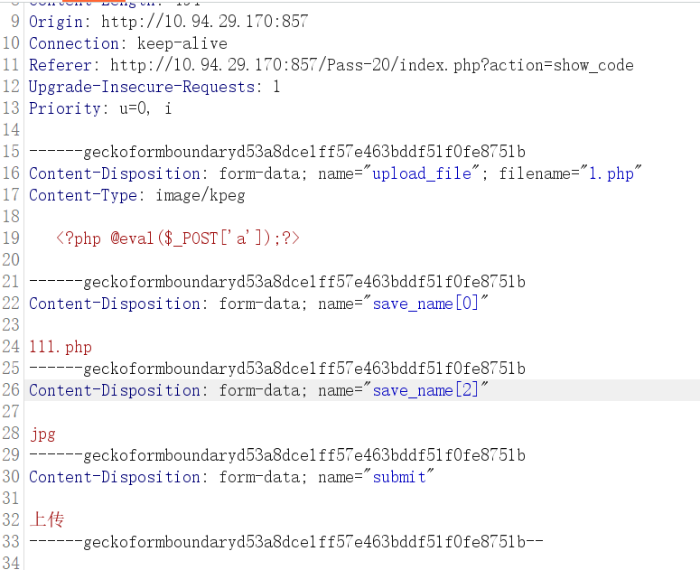
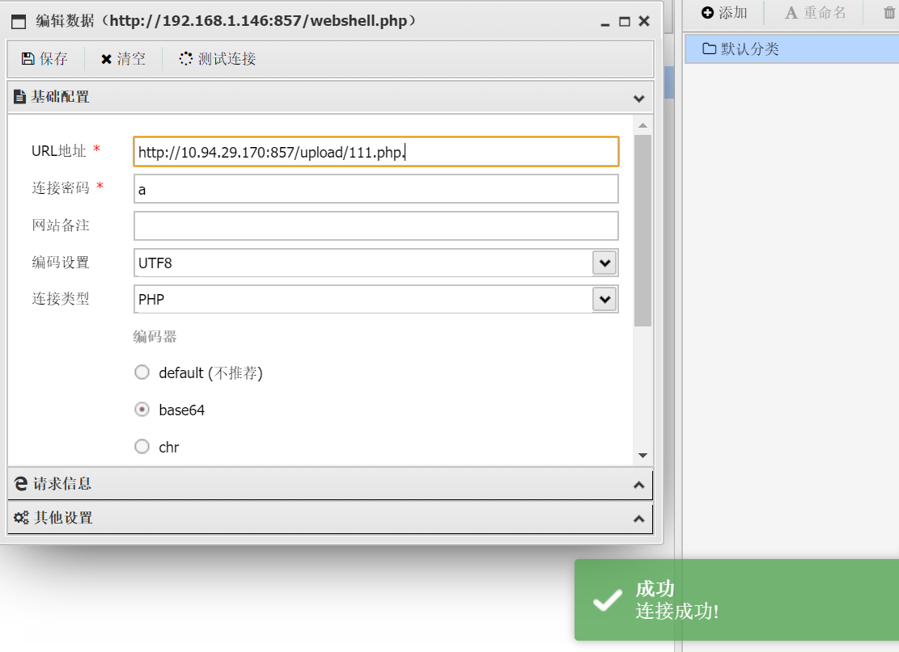

# pass-20

　　查看源码：

　　代码审计：

　　首先是MIME验证

　　再是分割数组

　　再是后缀白名单

　　再是函数验证

　　explode(a,b)函数以a为分割，把b转为数组。  
reset()函数把数组内部指针移动到数组第一个元素，并返回值。  
end() 把数组内部指针移动到数组最后一个元素，并返回值。  
count()函数数组元素的数量。​​

　　$file_name = reset($file) . '.' . $file[count($file) - 1];可以知道最终的文件名是由数组的第一个和最后一个元素拼接而成。如果是正常思维来讲，无论如何都是没有办法绕过的，但是有个地方给了提示

　　**判断：** 如果不是数组，就自己拆成数组，也就是说，我们是可以自己传数组进入的

　　**原理：**

　　若现自定义一个数组 arr[]，定义arr[0]=1,arr[3]=2, 此时count(arr)的值为2，则arr[count[arr]]即为arr[2]，但是arr[2]未定义，即为一个空值（**空字符**），若使用count()函数的本意是指向arr数组的最后一个元素，此时却指向arr[2]，形成数组漏洞。

　　‍

　　先上传 1.php 文件，利用 Burpsuite 进行抓包，发现save_name是利用_POST形式上传的，利用count()函数漏洞手动将 save_name改为数组形式，绕过白名单，并且合法化$image_path路径

　　这里修改MIME验证

　　需要复制一行 传入构造数组

　　以及最后修改后缀白名单jpg

　　连接成功

